# Assignment 2: Parallel Efficiency — MPI Monte Carlo π

<div align="center">
  <strong>Jinye Gong</strong><br>
  jinyeg@kth.se<br><br>
  <strong>Weiyi Lyu</strong><br>
  weiyil@kth.se<br><br>
  <strong>2026-04-18</strong>
</div>

## Contributions

The work in this assignment was shared equally between the two group members. We divided the experiments on Dardel, the school cluster, analysis, plotting, and report writing evenly, and both contributed throughout the whole process.

---

## Exercise 1: Calculate Parallel Efficiency

### Task 1: Dardel (compute nodes, batch jobs)

#### 1. Steps for compiling the code on Dardel

We uploaded `pi_mpi.c` and `Makefile` to `~/dd2356_a2` on Dardel. On the login node, the default Cray programming environment already provides MPI compiler wrappers. We built two binaries from the same source: one for strong scaling (default) and one for weak scaling (macro `ASSIGNMENT_WEAK_SCALING`).

```bash
cd ~/dd2356_a2
make clean
make CC=cc pi_mpi_strong pi_mpi_weak
```

This produces `pi_mpi_strong` and `pi_mpi_weak`. We use `cc` because it is the Cray MPI wrapper on Dardel and links against the correct `cray-mpich` libraries.

#### 2. Slurm commands used for executing the tests

We submitted batch jobs with our course allocation. The project account was taken from `projinfo` (`edu26.dd2356`). Each script requests up to 16 MPI tasks on the `shared` partition, loops over $n \in \{1,2,4,8,16\}$, and launches the program with `srun`.

```bash
chmod +x slurm_strong.sh slurm_weak.sh
sbatch slurm_strong.sh
sbatch slurm_weak.sh
```

The job scripts contain directives such as:

```bash
#SBATCH -J pi_strong
#SBATCH -A edu26.dd2356
#SBATCH -p shared
#SBATCH -n 16
#SBATCH -t 0:15:00
#SBATCH -o strong_%j.out
```

Inside the script, strong scaling runs:

```bash
srun -n "${n}" ./pi_mpi_strong 10000000
```

and weak scaling runs:

```bash
srun -n "${n}" ./pi_mpi_weak
```

We inspected results with `cat strong_<JOBID>.out` and `cat weak_<JOBID>.out`.

#### 3. Strong scaling — code in the region for Option 1 (total tosses = 10 million)

The total number of tosses is fixed. Each rank receives a fair share; ranks `0 ... (tosses % nproc - 1)` get one extra toss when the total is not divisible. In our experiments, $10^7$ is divisible by all tested `nproc`, but the code is written in a general way.

```c
local_tosses = tosses / nproc + (rank < (tosses % nproc) ? 1 : 0);
total_tosses = tosses;
```

#### 4. Strong scaling — screenshot of the output (Dardel)

Figure 1 shows the Slurm output for strong scaling on Dardel for 1, 2, 4, 8, and 16 processes with a total of 10,000,000 tosses (batch job `19763955`, file `strong_19763955.out`).

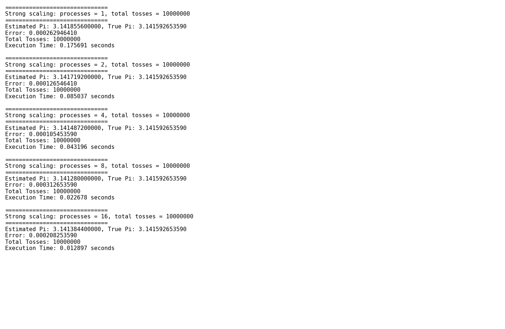

#### 5. Weak scaling — code in the region for Option 2 (local tosses = 1 million per process)

Each rank performs exactly 1,000,000 local tosses. The global total is $nproc \times 1{,}000{,}000$, which is used as the denominator when rank 0 estimates $\pi$.

```c
local_tosses = 1000000LL;
total_tosses = (long long int)nproc * local_tosses;
(void)tosses; /* argv[1] total not used in weak scaling */
```

#### 6. Weak scaling — screenshot of the output (Dardel)

Figure 2 shows the Slurm output for weak scaling on Dardel for 1, 2, 4, 8, and 16 processes (batch job `19763960`, file `weak_19763960.out`).

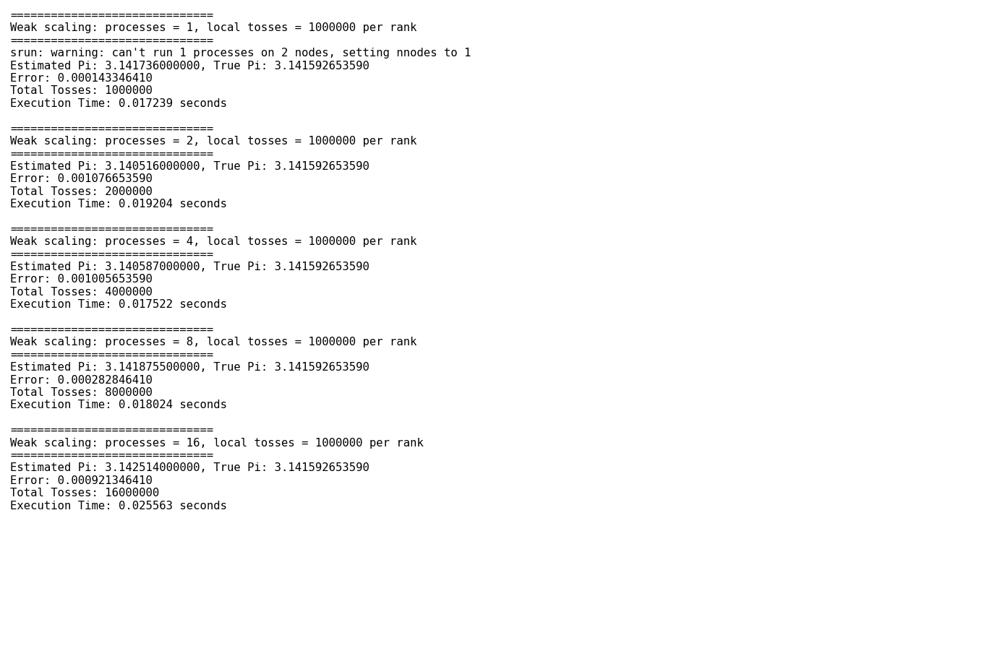

---

### Task 2: School cluster (“DD2356 — Medium CPU only”)

We started a Jupyter session with the **DD2356 - Medium CPU only** server option, opened a terminal as user `jovyan`, and used the same `pi_mpi.c` and `Makefile` under `~/dd2356_a2`.

#### 1. Compile and run

```bash
cd ~/dd2356_a2
make CC=mpicc pi_mpi_strong pi_mpi_weak
```

Strong scaling:

```bash
for n in 1 2 4 8 16; do
  echo "---- processes = $n ----"
  mpirun -np $n ./pi_mpi_strong 10000000
done
```

Weak scaling:

```bash
for n in 1 2 4 8 16; do
  echo "---- processes = $n ----"
  mpirun -np $n ./pi_mpi_weak
done
```

#### 2. Screenshots

Figure 3: Strong scaling output on the school cluster (Jupyter).

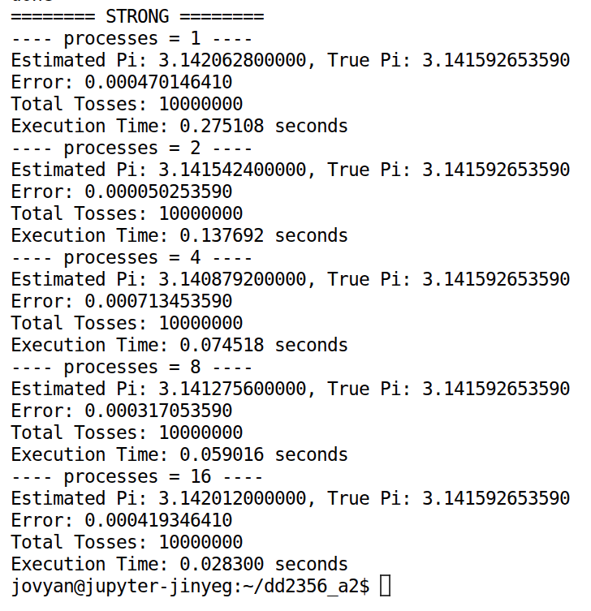

Figure 4: Weak scaling output on the school cluster (Jupyter).

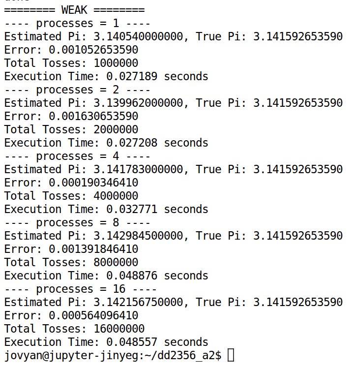

---

### Task 3: Weak scaling efficiency (both systems, one chart)

Weak scaling uses the following measure:

$$
E_{\mathrm{weak}}(p) = \frac{T_1}{T_p}
$$

Here, $T_1$ is the wall-clock time with one MPI process using the baseline local workload, and $T_p$ is the wall-clock time with $p$ MPI processes when each process keeps the same local workload. In this assignment, that workload is 1,000,000 tosses per process. Ideal weak scaling means that the runtime stays constant as $p$ grows, so $E_{\mathrm{weak}}(p) = 1$.

Figure 5 plots $E_{\mathrm{weak}}(p)$ for Dardel and the school Jupyter environment for $p \in \{1,2,4,8,16\}$.

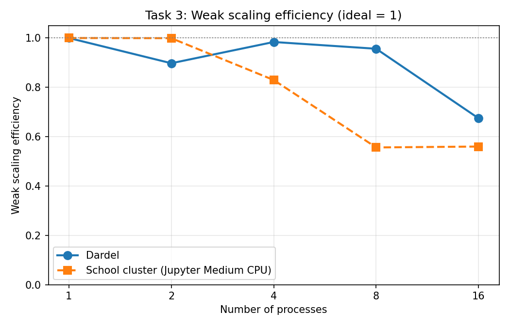

**Observations (1–2 sentences):**  
Both systems stay close to ideal scaling at small $p$, but the curve falls at larger $p$, especially on the school Jupyter node, because of MPI overhead and contention on a shared medium-CPU node. Dardel keeps a higher weak-scaling efficiency at 16 processes.

Numerical values:

| p    | Dardel | Jupyter |
| ---- | -----: | ------: |
| 1    | 1.0000 |  1.0000 |
| 2    | 0.8977 |  0.9993 |
| 4    | 0.9838 |  0.8297 |
| 8    | 0.9564 |  0.5563 |
| 16   | 0.6744 |  0.5599 |

---

### Task 4: Strong scaling efficiency (both systems, one chart)

Strong scaling uses the following measure:

$$
E_{\mathrm{strong}}(p) = \frac{T_1}{p \, T_p}
$$

Here, $T_1$ is the wall-clock time with one MPI process, $T_p$ is the wall-clock time with $p$ processes, and the global problem size stays the same when $p$ grows. In this assignment, the global problem size is 10,000,000 tosses in total. The product $p \, T_p$ represents the total core-time if all ranks run for time $T_p$. Ideal strong scaling means $E_{\mathrm{strong}}(p) = 1$.

Figure 6 plots $E_{\mathrm{strong}}(p)$ for both systems.

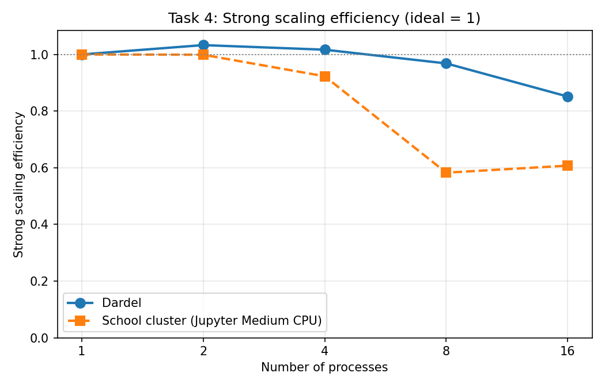

**Observations (1–2 sentences):**  
On Dardel, $E_{\mathrm{strong}}(p)$ stays near or slightly above 1 for small $p$, which is likely due to timing noise, and then drops to about 0.85 at 16 ranks. On the school cluster, it falls earlier, especially around 8 to 16 ranks, which is consistent with MPI overhead and resource sharing on one interactive node.

Numerical values:

| p    | Dardel | Jupyter |
| ---- | -----: | ------: |
| 1    | 1.0000 |  1.0000 |
| 2    | 1.0330 |  0.9990 |
| 4    | 1.0168 |  0.9230 |
| 8    | 0.9684 |  0.5827 |
| 16   | 0.8514 |  0.6076 |

---

## Exercise 2: Build Your Own Roofline Model

### Common code/build notes

We used the provided `simple_roofline` skeleton and compiled it with OpenMP.  
To make the project robust across systems, we used a C++-correct Makefile pattern (`.cpp -> .o`) and compiler variables (`CXX`, `CXXFLAGS`). We also increased per-point measurement stability by repeating each kernel call in the timing region and scaling both operation count and memory traffic consistently.

### Task 1: Dardel roofline

#### Compile and run on Dardel

```bash
cd ~/dd2356_a2/Exercise\ 2
sbatch slurm_dardel_roofline.sh
```

The Dardel job completed successfully (example batch job `19783303`), and we collected `dardel_roofline_raw.txt`.

#### Dardel final roofline figure

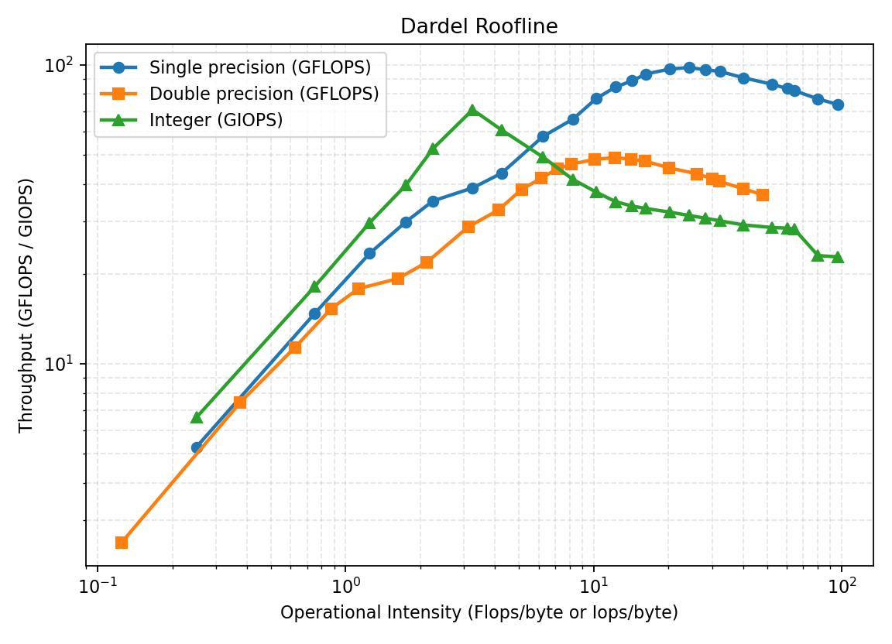

From `dardel_roofline_raw.txt`, the observed peaks are:

- Single precision peak: **98.03 GFLOPS**
- Double precision peak: **48.99 GFLOPS**
- Integer peak: **70.85 GIOPS**

### Task 2: Local system roofline

#### Build/run procedure and Makefile changes

```bash
cd assignment2/Exercise 2
make clean
make
./roofline | tee local_roofline_raw.txt
python3 plot_roofline.py --input local_roofline_raw.txt --title "Local Roofline" --output local_roofline.png
```

No extra local-only Makefile change was needed beyond the shared updated Makefile.

#### Local final roofline figure

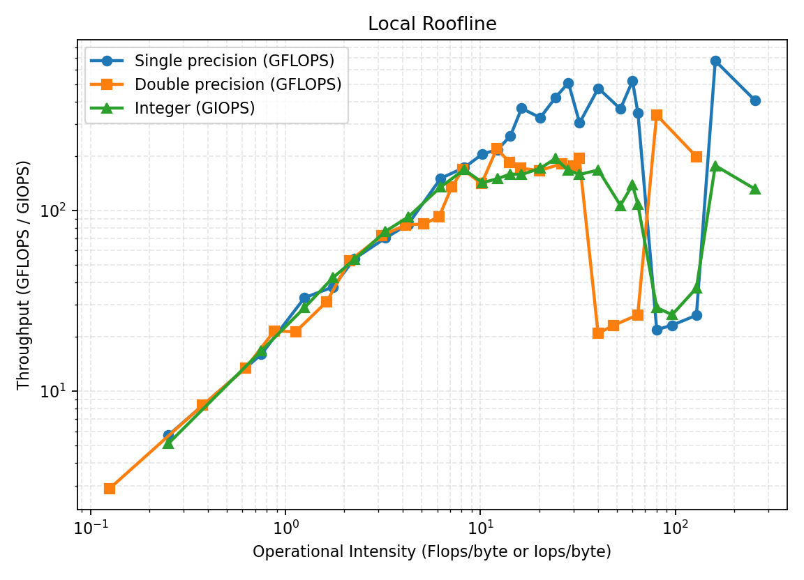

From `local_roofline_raw.txt`, the observed local peaks are:

- Single precision peak: **509.58 GFLOPS**
- Double precision peak: **220.14 GFLOPS**
- Integer peak: **193.86 GIOPS**

### Task 3: School cluster roofline (DD2356 - Medium CPU only)

#### Build/run procedure and Makefile changes

```bash
cd ~/dd2356_a2/Exercise\ 2
./run_school_cluster_roofline.sh
python3 plot_roofline.py --input school_roofline_raw.txt --title "School Cluster Roofline (DD2356 Medium CPU)" --output school_roofline.png
```

No additional cluster-specific Makefile edits were required beyond the shared updated Makefile.

#### School cluster final roofline figure

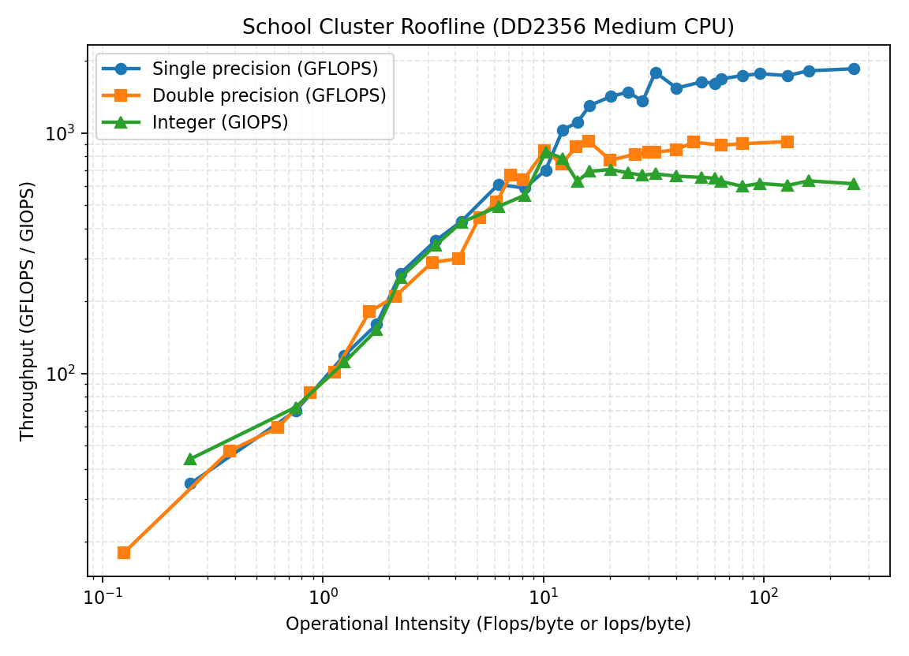

From the school-cluster output, the observed peaks are:

- Single precision peak: **1848.89 GFLOPS**
- Double precision peak: **922.34 GFLOPS**
- Integer peak: **834.60 GIOPS**

#### Dardel vs school cluster comparison

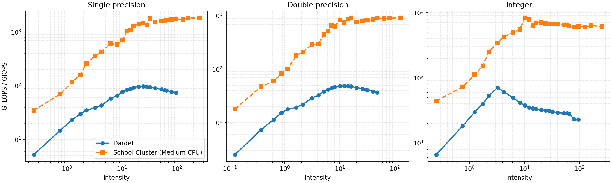

In this experiment, the school cluster reaches much higher SP/DP/INT ceilings than Dardel, so compute-intensive kernels have more headroom on the school cluster. Dardel’s curves saturate earlier and at lower throughput, which means high-intensity kernels hit the compute roof sooner and gain less from further arithmetic-intensity increases.

---

## Exercise 3: A Simple Performance Model of Sparse Matrix-Vector Multiply

### 1. Simple performance model for total execution time (compute part only)

For one SpMV, each nonzero contributes one multiply and one add:

$$
\mathrm{FLOPs} \approx 2 \cdot nnz
$$

For a penta-diagonal matrix, $nnz \approx 5N$ where $N$ is the number of rows (for large $N$), therefore:

$$
\mathrm{FLOPs} \approx 10N
$$

Using the assignment assumption “one instruction per cycle” and one-core clock frequency $f$:

$$
T_{\mathrm{model}} \approx \frac{10N}{f}
$$

This model intentionally excludes data movement and memory effects.

### 2. Estimated execution time from the simple model

We use one-core frequency values:

- Dardel (from `lscpu`): $f=2.25$ GHz
- Local machine (from `lscpu`): $f=5.20$ GHz
- School cluster (from `lscpu`): $f=3.80$ GHz

Estimated time (seconds) for $N=\{10^4,10^6,10^8\}$:

| System | Frequency (GHz) | $T_{model}(10^4)$ | $T_{model}(10^6)$ | $T_{model}(10^8)$ |
| --- | ---: | ---: | ---: | ---: |
| Dardel | 2.25 | $4.44\times10^{-5}$ | $4.44\times10^{-3}$ | $4.44\times10^{-1}$ |
| School cluster | 3.80 | $2.63\times10^{-5}$ | $2.63\times10^{-3}$ | $2.63\times10^{-1}$ |
| Local | 5.20 | $1.92\times10^{-5}$ | $1.92\times10^{-3}$ | $1.92\times10^{-1}$ |

### 3. Measured performance (time and FLOP/s)

#### How it is measured (1–2 sentences)

We compile `spmv.c` with optimization (`-O3 -march=native`) and run for `n=100,1000,10000`, corresponding to $N=n^2=10^4,10^6,10^8$. We read execution time from the program output and compute throughput as:

$$
\mathrm{GFLOP/s} = \frac{2\cdot nnz}{T \cdot 10^9}
$$

#### Local measured results

Command:

```bash
cd Exercise\ 3
./run_spmv_bench.sh
```

Results:

| $N$ (`nrows`) | `nnz` | Time (s) | GFLOP/s |
| ---: | ---: | ---: | ---: |
| $10^4$ | 49,600 | 0.000075 | 1.322667 |
| $10^6$ | 4,996,000 | 0.006995 | 1.428449 |
| $10^8$ | 499,960,000 | 0.815376 | 1.226330 |

#### Dardel and school cluster measurement commands (one core)

Dardel:

```bash
gcc -O3 -march=native -o spmv spmv.c
srun -N1 -n1 -c1 --cpu-bind=cores ./spmv 100
srun -N1 -n1 -c1 --cpu-bind=cores ./spmv 1000
srun -N1 -n1 -c1 --cpu-bind=cores ./spmv 10000
```

School cluster (Jupyter terminal):

```bash
gcc -O3 -march=native -o spmv spmv.c
taskset -c 0 ./spmv 100
taskset -c 0 ./spmv 1000
taskset -c 0 ./spmv 10000
```

#### Dardel measured results

For $N=10^8$, we requested explicit memory in `srun` (`--mem=20G`) to avoid OOM in the shared partition.

| $N$ (`nrows`) | `nnz` | Time (s) | GFLOP/s |
| ---: | ---: | ---: | ---: |
| $10^4$ | 49,600 | 0.000088 | 1.127273 |
| $10^6$ | 4,996,000 | 0.006254 | 1.597697 |
| $10^8$ | 499,960,000 | 0.504415 | 1.982431 |

#### School cluster measured results

CPU frequency reported by `lscpu`: `CPU max MHz: 3800.0000`.

| $N$ (`nrows`) | `nnz` | Time (s) | GFLOP/s |
| ---: | ---: | ---: | ---: |
| $10^4$ | 49,600 | 0.000080 | 1.240000 |
| $10^6$ | 4,996,000 | 0.008006 | 1.247064 |
| $10^8$ | 499,960,000 | 0.866479 | 1.154018 |

### 4. Model vs measured: reasons for differences

The simple model is compute-only, while real SpMV is typically memory-bound and irregular due to indirect indexing (`x[ja[idx]]`). This is consistent with measured results across all systems: local and school-cluster throughput is about 1.15–1.43 GFLOP/s, and Dardel is about 1.13–1.98 GFLOP/s, all far below the compute-only model expectation. Main sources of discrepancy are memory latency/bandwidth limits, cache/TLB misses, branch/control overhead, and instruction mix (integer address arithmetic + loads/stores in addition to floating-point operations).

### 5. How to estimate or measure read bytes

Two approaches:

1. **Analytical estimate (recommended first):**  
   Per nonzero, read `a[idx]` (8 B), `ja[idx]` (4 B), and `x[ja[idx]]` (8 B), i.e. about 20 B for 2 FLOPs. This gives a baseline arithmetic intensity around $0.1$ FLOP/B, further reduced when including row pointer and output write traffic.
2. **Counter-based measurement:**  
   Use hardware counters (e.g., `perf`, LIKWID, or PAPI) to measure memory traffic events and convert to bytes; compare with the analytical estimate.

### 6. Annotating SpMV on the roofline model

Using the analytical intensity ($\approx 0.09$–$0.10$ FLOP/B), the measured SpMV points should lie on the low-intensity (left) side of the roofline. For the local system, measured throughput around 1.2–1.4 GFLOP/s is far below the compute peak, indicating a memory-limited kernel where improving locality and reducing indirect-access cost is more impactful than increasing raw FLOP capability.

---

## Exercise 4: Perf Profiling

### Task 1: Matrix-Matrix Multiply (Naive vs Optimized loop order)

#### 1) Code transformation for optimized version

Starting from the naive triple loop order `i-j-k`, we created an optimized implementation by reordering loops to `i-k-j`:

- Naive: `matrix_b[k][j]` is accessed with a large stride in inner loops.
- Optimized (`i-k-j`): both `matrix_b[k][j]` and `matrix_r[i][j]` are traversed contiguously in the inner `j` loop.

In `Exercise 4/matrix_multiply.c`, both versions are available in one executable:

- Naive: `./matrix_multiply.out`
- Optimized: `./matrix_multiply.out opt`

Compiled with the required flags:

```bash
gcc -g -O2 matrix_multiply.c -o matrix_multiply.out
```

#### 2) Perf profiling command and metric approximations

We use:

```bash
perf stat -e cycles,instructions,L1-dcache-loads,L1-dcache-load-misses,LLC-loads,LLC-load-misses ./matrix_multiply.out
perf stat -e cycles,instructions,L1-dcache-loads,L1-dcache-load-misses,LLC-loads,LLC-load-misses ./matrix_multiply.out opt
```

Derived metrics:

- IPC = `instructions / cycles`
- L1 miss rate ≈ `L1-dcache-load-misses / L1-dcache-loads`
- LLC miss rate ≈ `LLC-load-misses / LLC-loads`

If direct miss-rate events are unavailable on a platform, these ratios are used as approximations from load and load-miss counters.

#### 3) Local perf results (`MSIZE=64,1000`)

We ran:

```bash
gcc -g -O2 -DMSIZE=64 matrix_multiply.c -o matrix_multiply_64.out
gcc -g -O2 matrix_multiply.c -o matrix_multiply_1000.out
perf stat -e cycles,instructions,L1-dcache-loads,L1-dcache-load-misses,LLC-loads,LLC-load-misses taskset -c 0 ./matrix_multiply_64.out
perf stat -e cycles,instructions,L1-dcache-loads,L1-dcache-load-misses,LLC-loads,LLC-load-misses taskset -c 0 ./matrix_multiply_64.out opt
perf stat -e cycles,instructions,L1-dcache-loads,L1-dcache-load-misses,LLC-loads,LLC-load-misses taskset -c 0 ./matrix_multiply_1000.out
perf stat -e cycles,instructions,L1-dcache-loads,L1-dcache-load-misses,LLC-loads,LLC-load-misses taskset -c 0 ./matrix_multiply_1000.out opt
```

Results:

| MSIZE | Impl. | Elapsed time (s) | IPC | L1 miss rate | LLC miss rate |
| ---: | --- | ---: | ---: | ---: | ---: |
| 64 | Naive | 3.8e-05 | 2.232 | 0.740% | 39.700% |
| 64 | Optimized | 6.3e-05 | 1.368 | 1.000% | 8.618% |
| 1000 | Naive | 0.367077 | 1.514 | 47.845% | 1.243% |
| 1000 | Optimized | 0.208074 | 3.498 | 7.246% | 2.036% |

For `MSIZE=1000`, loop reordering reduces elapsed time by about **1.76×** and sharply decreases L1 miss rate.

#### 4) Main factors impacting performance

For smaller matrices (e.g., `MSIZE=64`), data tends to fit in lower-level caches and the difference between naive and optimized is smaller. For larger matrices (e.g., `MSIZE=1000`), cache locality dominates: the optimized loop order significantly reduces cache-miss pressure, so memory hierarchy behavior becomes the main performance driver.

### Task 2: Matrix Transpose Profiling and Cache-Reuse Optimization

#### 1) Modified transpose code and transformation

In `Exercise 4/transpose.c`, we added:

- Runtime matrix size argument (`N=64,128,2048`, etc.)
- A blocked transpose (`transposeBlocked`) for better cache reuse
- Mode selection:
  - Base: `./transpose.out N`
  - Blocked: `./transpose.out N blocked 32`

Compiled with the required flags:

```bash
gcc -O2 -o transpose.out transpose.c
```

#### 2) Perf profiling command (N = 64, 128, 2048)

```bash
perf stat -e cycles,instructions,L1-dcache-loads,L1-dcache-load-misses,LLC-loads,LLC-load-misses ./transpose.out 64
perf stat -e cycles,instructions,L1-dcache-loads,L1-dcache-load-misses,LLC-loads,LLC-load-misses ./transpose.out 128
perf stat -e cycles,instructions,L1-dcache-loads,L1-dcache-load-misses,LLC-loads,LLC-load-misses ./transpose.out 2048
```

Same approximations apply:

- IPC = `instructions / cycles`
- L1 miss rate ≈ `L1-dcache-load-misses / L1-dcache-loads`
- LLC miss rate ≈ `LLC-load-misses / LLC-loads`

Bandwidth is taken from program output (`Base Rate`), not from perf.

#### 3) Local transpose measurements (`N=64,128,2048`)

Base mode (`./transpose.out N`) with perf:

| N | Elapsed time (s) | Bandwidth (MB/s) | IPC | L1 miss rate | LLC miss rate |
| ---: | ---: | ---: | ---: | ---: | ---: |
| 64 | 1.10e-06 | 2.99e+04 | 1.124 | 3.503% | 24.726% |
| 128 | 8.49e-06 | 1.54e+04 | 1.710 | 54.478% | 21.978% |
| 2048 | 2.55e-02 | 1.31e+03 | 0.242 | 78.984% | 26.616% |

Blocked mode (`./transpose.out 2048 blocked 32`) snapshot:

| N | Elapsed time (s) | Bandwidth (MB/s) | IPC | L1 miss rate | LLC miss rate |
| ---: | ---: | ---: | ---: | ---: | ---: |
| 2048 | 7.84e-03 | 4.28e+03 | 0.720 | 19.357% | 23.091% |

#### 4) Observations and cache-reuse analysis

For small matrices, blocking may not always help because base traversal can already leverage cache and loop overhead may dominate. For larger matrices (`N=2048`), blocking substantially improves locality: bandwidth rises from **1.31e3 MB/s** to **4.28e3 MB/s**, while L1 miss rate drops from **78.98%** to **19.36%**.

---

## Bonus Exercise: MPI Ping-Pong RTT and Network Model

### Task 1: Run ping-pong benchmark

#### Dardel (two compute nodes)

We use Slurm to force one rank per node:

```bash
cd ~/dd2356_a2/Bonus
sbatch slurm_dardel_pingpong.sh
```

In `slurm_dardel_pingpong.sh`:

- `#SBATCH -N 2 -n 2 --ntasks-per-node=1` ensures two ranks on two different nodes.
- `#SBATCH -A edu26.dd2356 -p shared` uses the course allocation and available partition.

This setup is chosen to measure inter-node RTT instead of intra-node latency.

#### School cluster (two ranks)

Commands used:

```bash
cd ~/dd2356_a2/Bonus
make CC=mpicc
mpirun -np 2 ./ping_pong_mpi 4194304 2000 50 > school_pingpong_rtt.csv
```

### Task 2: Fit linear RTT model and compare measured vs predicted RTT

#### Python fitting code

We use `fit_pingpong_model.py` to fit:

$$
\mathrm{RTT}_{\mu s}(m) = \alpha + \beta \cdot m
$$

where $m$ is message size in bytes.

Run:

```bash
python3 fit_pingpong_model.py --input school_pingpong_rtt.csv --system "School cluster" --output-prefix school
```

#### School cluster analytical model

From `school_model.txt`:

$$
\mathrm{RTT}_{\mu s}(m) = -3.333704 + 0.000160607 \cdot m,\quad R^2 = 0.991840
$$

This high $R^2$ indicates that a linear model explains most variance over the measured message-size range.

#### School cluster measured vs predicted plot

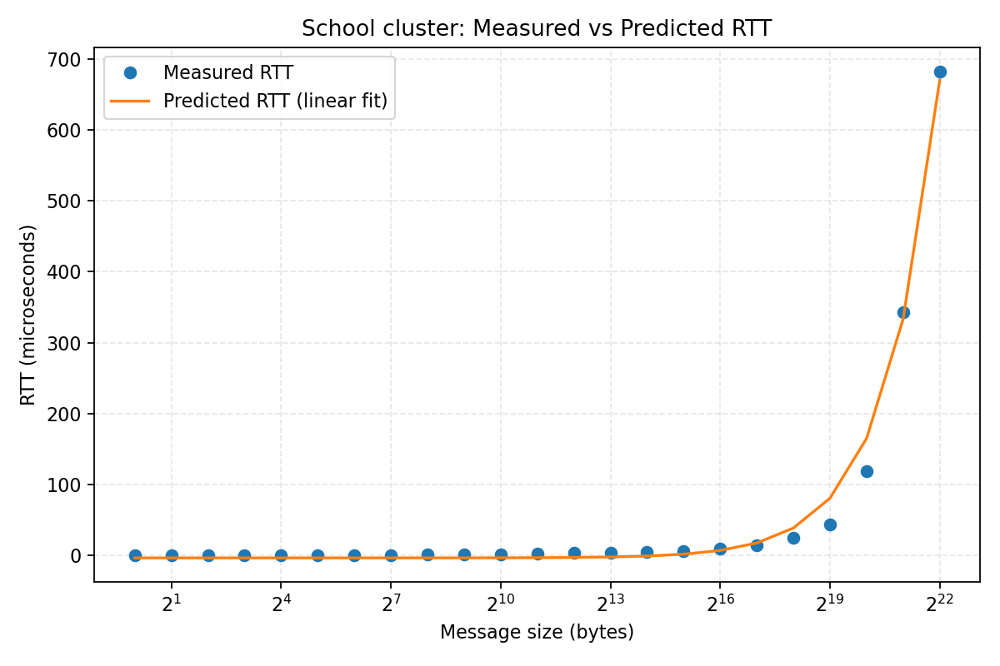

**Observation (2–3 sentences).**  
The linear model matches the measured RTT trend well for medium and large messages, as shown by the high $R^2$. At very small message sizes, fixed software/protocol overhead causes deviations from pure linear behavior. As message size grows, the bandwidth term dominates and RTT increases approximately linearly with bytes.

#### Dardel analytical model

After pulling `dardel_pingpong_rtt.csv` from Dardel, run:

```bash
python3 fit_pingpong_model.py --input dardel_pingpong_rtt.csv --system "Dardel" --output-prefix dardel
```

From `dardel_model.txt`:

$$
\mathrm{RTT}_{\mu s}(m) = 7.369035 + 0.000103454 \cdot m,\quad R^2 = 0.998939
$$

This fit is highly linear over the tested message-size range.

#### Dardel measured vs predicted plot

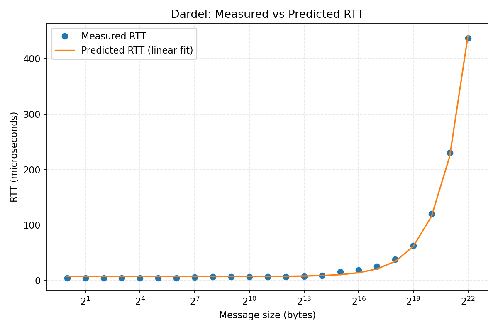

**Comparison and observation (2–3 sentences).**  
Both systems are well described by the linear model (high $R^2$). Dardel has a lower slope ($\beta = 1.03454\times10^{-4}$ us/byte) than the school cluster ($\beta = 1.60607\times10^{-4}$ us/byte), indicating better effective bandwidth for larger messages. The school-cluster fit gives a non-physical negative intercept, which usually reflects limited small-message samples and fitting bias near the latency-dominated region.
