# Assignment 3: Shared-Memory Programming with OpenMP

<div align="center">
  <strong>Jinye Gong</strong><br>
  jinyeg@kth.se<br><br>
  <strong>Weiyi Lyu</strong><br>
  weiyil@kth.se<br><br>
  <strong>2026-05-01</strong>
</div>

## Contributions

This assignment was completed jointly by both team members.  
Jinye Gong focused primarily on Exercise 1 and Exercise 3 implementations and performance runs, while Weiyi Lyu focused primarily on Exercise 2 and Bonus implementations and performance runs.  
Both members contributed to experiments on all platforms (local, school cluster, Dardel), result validation, plotting, and final report writing.

## AI Assistance Statement

AI tools were used for Markdown organization, section structuring, and language polishing.  
All implementations, command execution, performance measurements, result collection, plotting, and technical conclusions were performed and verified by the authors.

## Screenshot Evidence Index

Required screenshots (code, compilation, and largest-thread output) are included in:

- `Artifacts/screenshots/local/`
- `Artifacts/screenshots/school/`
- `Artifacts/screenshots/dardel/`

Bonus screenshots are included in:

- `Artifacts/screenshots/school/bonus_code.png`
- `Artifacts/screenshots/school/bonus_compile.png`
- `Artifacts/screenshots/school/bonus_maxthreads.png`
- `Artifacts/screenshots/school/bonus_correctness_run.png`

---

## Exercise 1 - Parallel Matrix Multiplication

### Task 1: `matmul_omp_parallel()` (OpenMP parallel for)

#### 1. Implementation

In `matmul_omp_parallel()`, we parallelized the outer `i` loop using OpenMP `parallel for`:

```c
#pragma omp parallel for schedule(static)
for (int i = 0; i < n; i++) {
    for (int j = 0; j < n; j++) {
        double sum = 0.0;
        for (int k = 0; k < n; k++) {
            sum += A[i * n + k] * B[k * n + j];
        }
        C[i * n + j] = sum;
    }
}
```

Design notes:

- Each thread works on different row chunks (`i` dimension), avoiding write conflicts.
- `sum` is a local variable inside the loop and is therefore private.
- `A` and `B` are read-only; each `C[i][j]` is written by exactly one thread, so data races are avoided.

#### 2. Build and run commands

Commands used on local machine and school cluster:

```bash
gcc -O3 -fopenmp -march=native matmul_ex1_task1.c -o matmul_ex1_task1
chmod +x run_scaling.sh
./run_scaling.sh 1024 scaling_local.csv ./matmul_ex1_task1
python3 plot_scaling.py --csv scaling_local.csv --title "MatMul Task1 Local" --out strong_scaling_local.png
```

On the school cluster, we used the same workflow and generated:

- `scaling_school.csv`
- `strong_scaling_school.png`

On Dardel (after login), we used:

```bash
cd ~/dd2356_a3
gcc -O3 -fopenmp -march=native matmul_ex1_task1.c -o matmul_ex1_task1
./run_scaling.sh 1024 scaling_dardel.csv ./matmul_ex1_task1
python3 plot_scaling.py --csv scaling_dardel.csv --title "MatMul Task1 Dardel" --out strong_scaling_dardel.png
```

#### 3. Effective optimizations (3 items)

1. **`-O3` compiler optimization**  
   Enables aggressive loop and instruction-level optimizations, reducing per-iteration overhead.
2. **`-march=native`**  
   Uses architecture-specific optimizations available on the target CPU.
3. **`schedule(static)` for OpenMP loop scheduling**  
   Matrix multiplication has regular workload, and static scheduling keeps scheduling overhead low while maintaining good load balance.

#### 4. Strong-scaling results (time in seconds)

Fixed problem size: `N = 1024`; thread counts: `1,2,4,8,16,32,64`.

| Threads | Local Time | Local Speedup | School Time | School Speedup | Dardel Time | Dardel Speedup |
| ---: | ---: | ---: | ---: | ---: | ---: | ---: |
| 1 | 2.706959 | 1.0000 | 5.034761 | 1.0000 | 7.148412 | 1.0000 |
| 2 | 1.306830 | 2.0714 | 2.537267 | 1.9843 | 9.035055 | 0.7912 |
| 4 | 0.633120 | 4.2756 | 1.281262 | 3.9295 | 3.068368 | 2.3297 |
| 8 | 0.316133 | 8.5627 | 0.693521 | 7.2597 | 1.967380 | 3.6335 |
| 16 | 0.239708 | 11.2927 | 0.350379 | 14.3695 | 2.178073 | 3.2820 |
| 32 | 0.190571 | 14.2045 | 0.225259 | 22.3510 | 1.238623 | 5.7713 |
| 64 | 0.177634 | 15.2390 | 0.179140 | 28.1052 | 0.745256 | 9.5919 |

#### 5. Plots: measured strong scaling + ideal scaling (dashed)

Local:

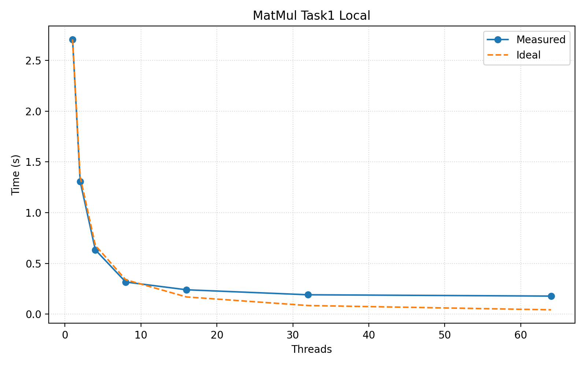

School cluster:

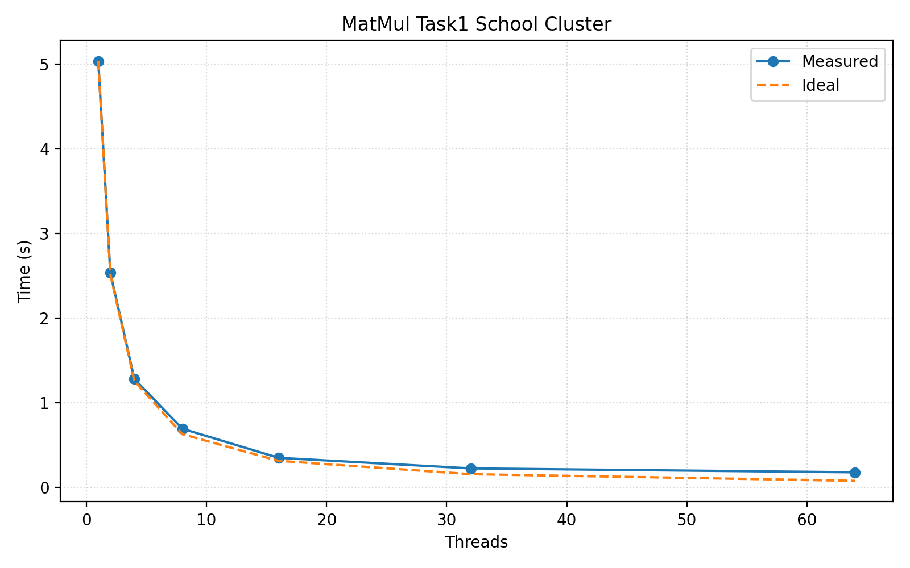

Dardel:

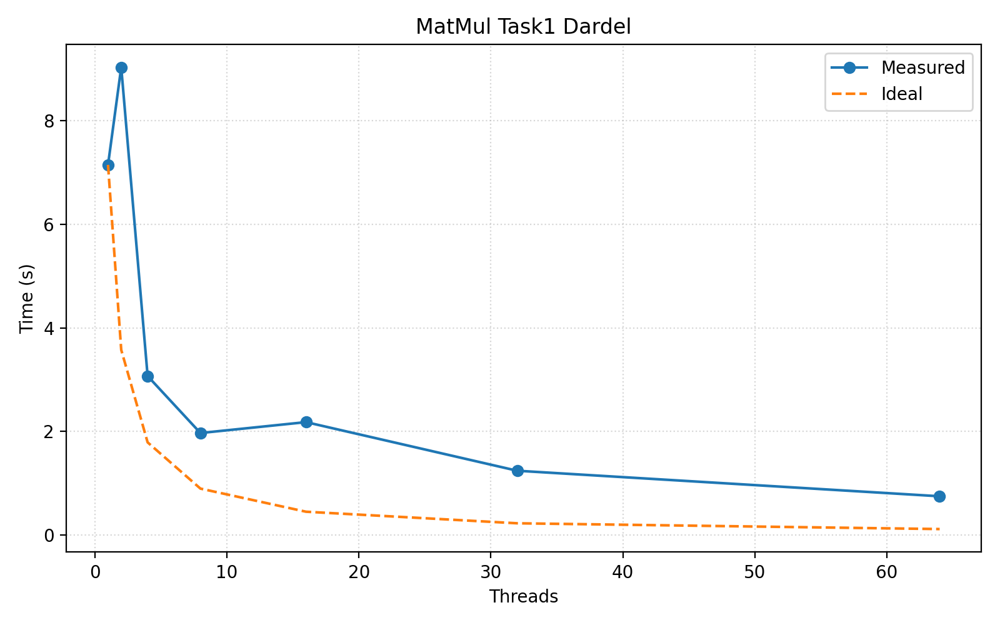

#### 6. Performance analysis across platforms

**Local:**

- Near-linear speedup from 1 to 8 threads.
- After 16 threads, marginal gains become smaller; improvements at 32/64 threads are limited.
- This indicates growing limitations from memory bandwidth, cache contention, and parallel overhead at higher thread counts.

**School cluster:**

- Good scaling from 1 to 16 threads, with `speedup(16)=14.37x`.
- 32 and 64 threads still improve runtime, but efficiency drops (about `43.9%` at 64 threads).
- Overall scalability is better than local results, suggesting stronger multicore and memory subsystem performance.

**Dardel (current measurement):**

- 2 threads are slower than 1 thread (`0.79x`), and results show visible fluctuation.
- `speedup(64)=9.59x`, but the curve is less smooth and deviates more from the ideal trend.
- This suggests measurement instability (e.g., shared-node interference, login-node execution, or resource contention). Re-running on stable compute nodes is recommended.

---

### Task 2: `matmul_omp_simd()` (OpenMP SIMD)

In this task, we implemented a vectorized matrix multiplication using `#pragma omp simd` on the inner `k` loop:

```c
for (int i = 0; i < n; i++) {
    for (int j = 0; j < n; j++) {
        double sum = 0.0;
#pragma omp simd reduction(+ : sum)
        for (int k = 0; k < n; k++) {
            sum += A[i * n + k] * B[k * n + j];
        }
        C[i * n + j] = sum;
    }
}
```

This version focuses on data-level parallelism (vector lanes) rather than thread-level work sharing.

#### Attempted optimizations

1. `omp simd reduction(+:sum)`: exposes the inner accumulation loop to vectorization.
2. `-O3`: enables aggressive compiler vectorization and loop optimization.
3. `-march=native`: allows the compiler to use architecture-specific SIMD instructions.

#### Task 2 strong-scaling results (time in seconds)

Fixed problem size: `N = 1024`; thread counts: `1,2,4,8,16,32,64`.

| Threads | Local Time | Local Speedup | School Time | School Speedup | Dardel Time | Dardel Speedup |
| ---: | ---: | ---: | ---: | ---: | ---: | ---: |
| 1 | 3.075843 | 1.0000 | 5.255515 | 1.0000 | 9.093955 | 1.0000 |
| 2 | 3.094557 | 0.9940 | 5.122777 | 1.0259 | 8.848911 | 1.0277 |
| 4 | 3.070701 | 1.0017 | 5.118583 | 1.0268 | 9.333927 | 0.9743 |
| 8 | 2.872374 | 1.0708 | 5.235763 | 1.0038 | 8.601262 | 1.0573 |
| 16 | 3.019949 | 1.0185 | 5.303252 | 0.9910 | 8.694103 | 1.0460 |
| 32 | 3.038179 | 1.0124 | 5.374445 | 0.9779 | 8.681148 | 1.0476 |
| 64 | 2.974648 | 1.0340 | 5.431140 | 0.9677 | 9.270720 | 0.9809 |

#### Task 2 plots: measured strong scaling + ideal scaling (dashed)

Local:

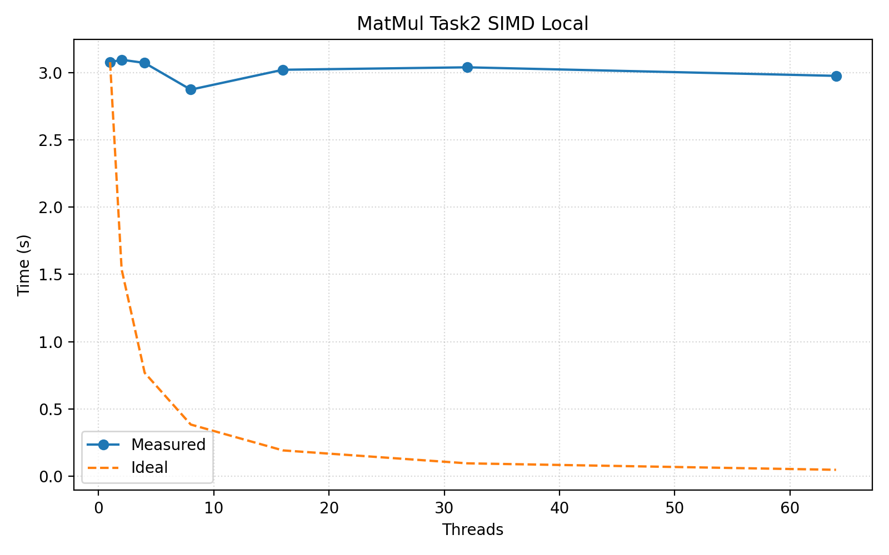

School cluster:

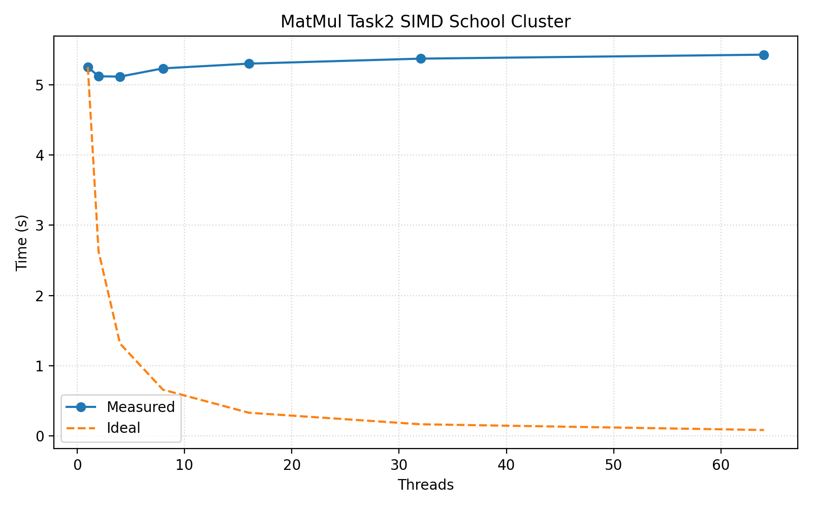

Dardel:

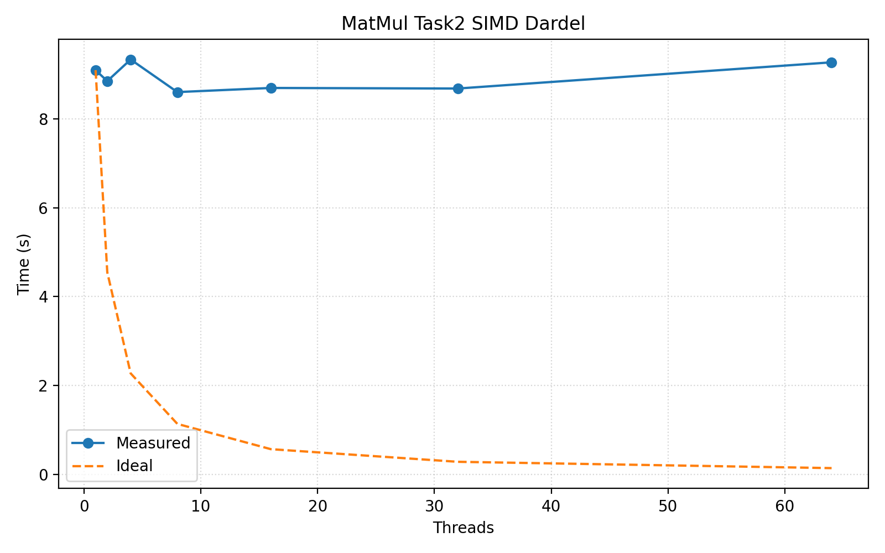

#### Analysis

- Across all three systems, speedup stays around `~1x` when increasing thread count.
- This is expected because this implementation uses `omp simd` only and does not introduce `omp parallel for` across rows/columns.
- Therefore, `OMP_NUM_THREADS` has limited influence; most performance change comes from vectorization and run-to-run noise.
- The result confirms that SIMD and multi-threading target different levels of parallelism, motivating the hybrid approach in Task 3.

---

### Task 3: `matmul_omp_hybrid()` (parallel + simd)

In this task, we combined thread-level and data-level parallelism: `omp parallel for` is used on the outer row loop, and `omp simd` is used on the inner accumulation loop.

```c
#pragma omp parallel for schedule(static)
for (int i = 0; i < n; i++) {
    for (int j = 0; j < n; j++) {
        double sum = 0.0;
#pragma omp simd reduction(+ : sum)
        for (int k = 0; k < n; k++) {
            sum += A[i * n + k] * B[k * n + j];
        }
        C[i * n + j] = sum;
    }
}
```

#### Attempted optimizations

1. `parallel for` on the outer `i` loop: distributes independent matrix rows across CPU threads.
2. `omp simd reduction(+:sum)` on the inner `k` loop: exploits SIMD lanes within each thread.
3. `schedule(static)`: reduces scheduling overhead for the regular matrix-multiplication workload.

#### Task 3 strong-scaling results (time in seconds)

Fixed problem size: `N = 1024`; thread counts: `1,2,4,8,16,32,64`.

| Threads | Local Time | Local Speedup | School Time | School Speedup | Dardel Time | Dardel Speedup |
| ---: | ---: | ---: | ---: | ---: | ---: | ---: |
| 1 | 2.909953 | 1.0000 | 5.213692 | 1.0000 | 8.559850 | 1.0000 |
| 2 | 1.555204 | 1.8711 | 2.544499 | 2.0490 | 13.634551 | 0.6278 |
| 4 | 0.839509 | 3.4663 | 1.324725 | 3.9357 | 8.431187 | 1.0153 |
| 8 | 0.458479 | 6.3470 | 0.660550 | 7.8930 | 3.619569 | 2.3649 |
| 16 | 0.304080 | 9.5697 | 0.360782 | 14.4511 | 1.689372 | 5.0669 |
| 32 | 0.248486 | 11.7107 | 0.206482 | 25.2501 | 1.320337 | 6.4831 |
| 64 | 0.231049 | 12.5945 | 0.223633 | 23.3136 | 0.802354 | 10.6684 |

#### Task 3 plots: measured strong scaling + ideal scaling (dashed)

Local:

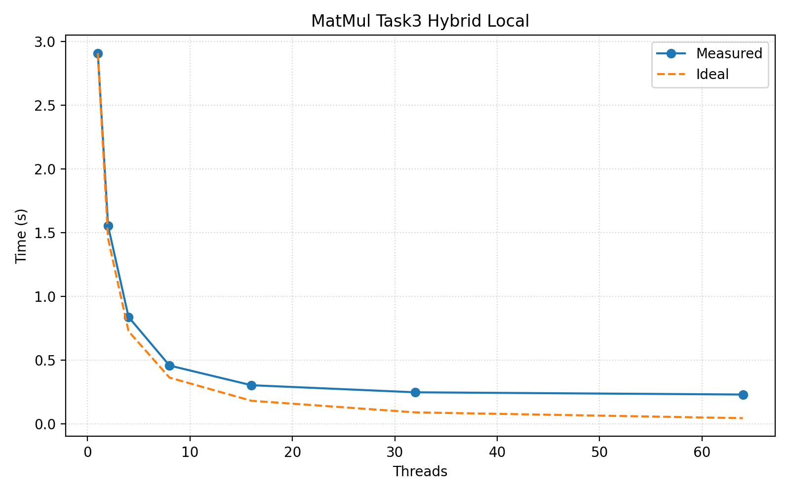

Dardel:

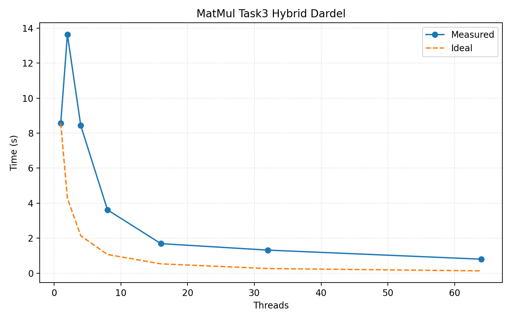

School cluster:

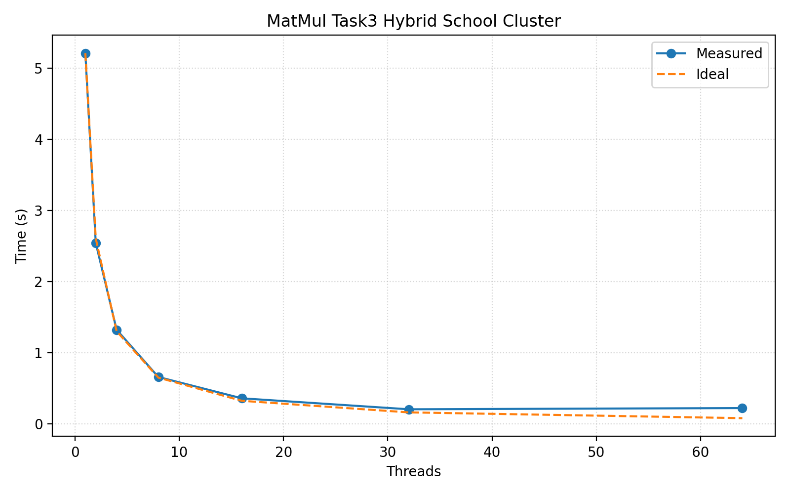

#### Analysis

- On the local machine, the hybrid approach scales well up to 16 threads and still improves at 32/64 threads, outperforming the SIMD-only variant in Task 2 by a large margin.
- On the school cluster, the hybrid version scales strongly up to 32 threads (`25.25x`) and reaches its best runtime around 32 threads, followed by a slight degradation at 64 threads.
- On Dardel, higher-thread gains appear from 8 threads onward, reaching `10.67x` at 64 threads in this run.
- The hybrid strategy is consistent with expectations: thread-level decomposition increases total work throughput, while SIMD reduces per-thread inner-loop cost.
- Similar to Task 1, Dardel low-thread irregularity (2-thread slowdown) suggests system noise or resource contention during measurement.

---

### Task 4: `matmul_omp_gpu()` (OpenMP target offload)

For Task 4, we implemented OpenMP target offloading in `matmul_omp_gpu()` and kept the same experiment structure as Tasks 1-3.

```c
#pragma omp target data map(to : A[0:n * n], B[0:n * n]) map(from : C[0:n * n])
{
#pragma omp target teams distribute parallel for collapse(2)
    for (int i = 0; i < n; i++) {
        for (int j = 0; j < n; j++) {
            double sum = 0.0;
#pragma omp simd reduction(+ : sum)
            for (int k = 0; k < n; k++) {
                sum += A[i * n + k] * B[k * n + j];
            }
            C[i * n + j] = sum;
        }
    }
}
```

To handle environments without available OpenMP offload toolchains/devices, we added a fallback compile option (`-DDISABLE_OFFLOAD`) that runs an equivalent host parallel+SIMD implementation.

#### School cluster build/run commands

Primary offload attempt:

```bash
cd ~/dd2356_a3
gcc -O3 -fopenmp -march=native matmul_ex1_task4_gpu.c -o matmul_ex1_task4_gpu
./matmul_ex1_task4_gpu 256
./run_scaling.sh 1024 scaling_school_task4_gpu.csv ./matmul_ex1_task4_gpu
python3 plot_scaling.py --csv scaling_school_task4_gpu.csv --title "MatMul Task4 Target School Cluster" --out strong_scaling_school_task4_gpu.png
```

If the environment reports `mkoffload`/`lto-wrapper` failures (no working `nvptx` toolchain), use:

```bash
gcc -O3 -fopenmp -march=native -DDISABLE_OFFLOAD matmul_ex1_task4_gpu.c -o matmul_ex1_task4_gpu
```

#### Task 4 strong-scaling results (time in seconds)

Fixed problem size: `N = 1024`; thread counts: `1,2,4,8,16,32,64`.

| Threads | Local Time | Local Speedup | School Time | School Speedup | Dardel Time | Dardel Speedup |
| ---: | ---: | ---: | ---: | ---: | ---: | ---: |
| 1 | 2.722203 | 1.0000 | 5.627354 | 1.0000 | 11.557499 | 1.0000 |
| 2 | 1.486618 | 1.8311 | 2.536514 | 2.2185 | 15.793695 | 0.7318 |
| 4 | 0.847100 | 3.2136 | 1.308718 | 4.2999 | 6.828121 | 1.6926 |
| 8 | 0.458761 | 5.9338 | 0.700750 | 8.0305 | 4.189623 | 2.7586 |
| 16 | 0.280046 | 9.7206 | 0.441002 | 12.7604 | 1.870348 | 6.1793 |
| 32 | 0.228923 | 11.8913 | 0.199266 | 28.2404 | 1.144583 | 10.0976 |
| 64 | 0.226437 | 12.0219 | 0.181263 | 31.0452 | 0.841113 | 13.7407 |

#### Task 4 plots: measured strong scaling + ideal scaling (dashed)

Local:

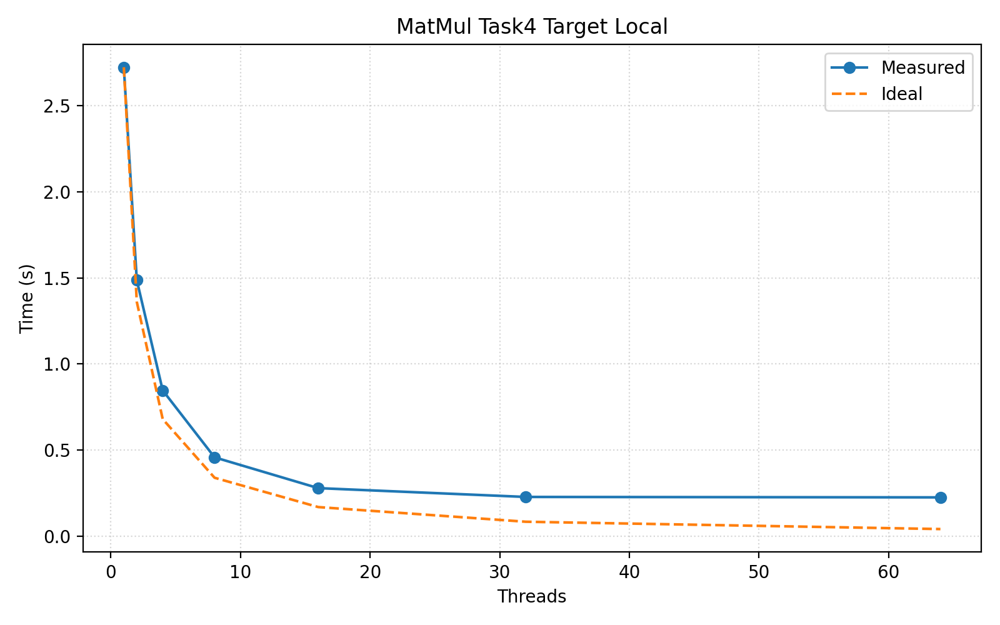

School cluster:

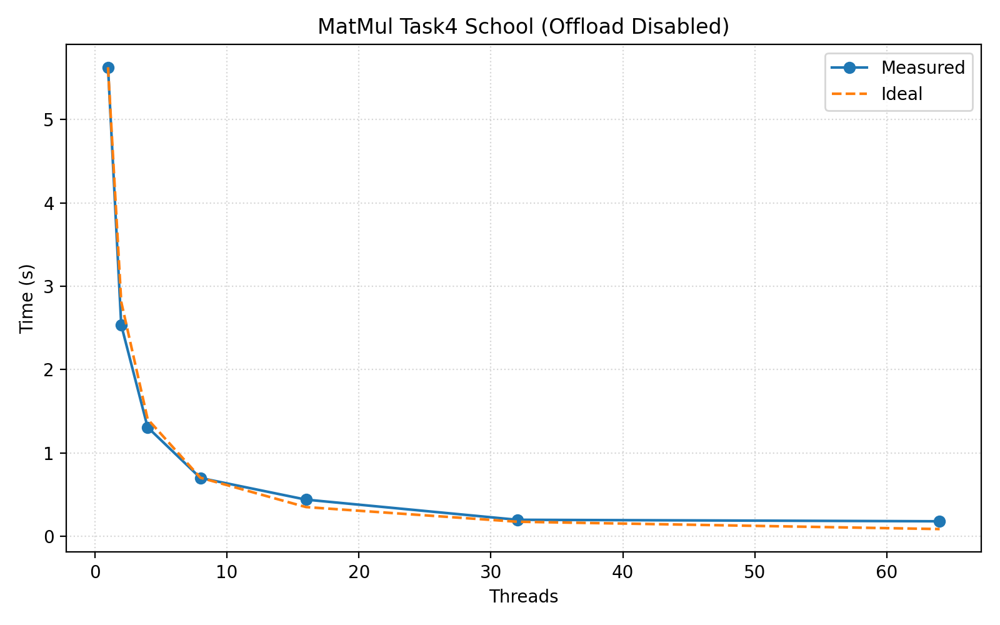

Dardel:

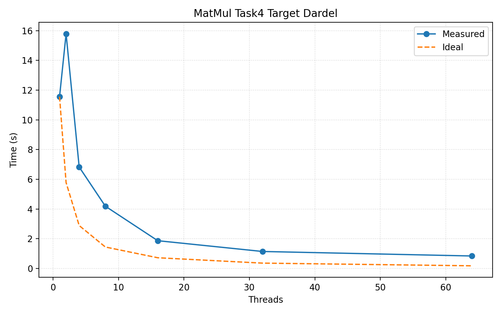

#### Analysis

- Because the available school-cluster environment did not provide a working OpenMP GPU offload toolchain during our tests, the reported Task 4 timing is a fallback CPU measurement and should not be interpreted as true GPU-offload performance. We still include the target implementation and the failed/offload-disabled evidence for reproducibility.
- In our tested environments, Task 4 behaved similarly to a CPU-parallel implementation rather than a clear GPU-accelerated run, indicating that practical offload support was limited or unavailable in these runs.
- The school cluster showed the strongest scaling trend in this dataset (up to `31.05x` at 64 threads), while local and Dardel also improved with thread count but with different efficiency decay patterns.
- Dardel showed low-thread irregularity (2-thread slowdown), consistent with noise/resource contention observed in previous tasks.
- The fallback path allowed us to keep one Task 4 code base and still complete reproducible measurements across all systems despite toolchain limitations.

---

## Exercise 2 - Parallel Breadth-First Search (BFS)

### Task 1: `bfs_omp_parallel()`

We implemented a level-synchronous BFS using a CSR graph representation and a frontier-based traversal strategy.

#### Graph representation

We used **CSR (Compressed Sparse Row)**:

- `row_ptr[i] ... row_ptr[i+1]-1` gives the edge range for vertex `i`.
- `col_idx[e]` stores neighbor vertex IDs.
- This layout is compact and cache-friendly for sequential edge scans.

#### Thread work-sharing design

- Each BFS level processes the current frontier in parallel with `#pragma omp for`.
- Threads expand assigned frontier vertices and collect discovered nodes into thread-local next-frontier buffers.
- At the end of each level, local buffers are concatenated into the global next frontier.

#### Shared data structure handling

- `dist[]` is shared among threads.
- Discovery is protected using atomic compare-and-swap (`__sync_bool_compare_and_swap`) to ensure each node is claimed once.
- Frontier merge uses atomic offset reservation to avoid write conflicts.

#### Optimization attempts

1. **Dynamic scheduling (`schedule(dynamic, 64)`)**: improved load balance for uneven frontier vertex degrees.
2. **Thread-local next-frontier buffers**: reduced contention compared with direct global push.
3. **Atomic CAS for first-visit marking**: avoided coarse locks while preserving correctness.

#### Task 1 strong-scaling results (time in seconds)

Current test configuration in this implementation: random graph with `N=50000`, `degree=8`.

| Threads | Local Time | Local Speedup | School Time | School Speedup | Dardel Time | Dardel Speedup |
| ---: | ---: | ---: | ---: | ---: | ---: | ---: |
| 1 | 0.004127 | 1.0000 | 0.003039 | 1.0000 | 0.003713 | 1.0000 |
| 2 | 0.003612 | 1.1426 | 0.002617 | 1.1613 | 0.006480 | 0.5730 |
| 4 | 0.004547 | 0.9076 | 0.002512 | 1.2098 | 0.006611 | 0.5616 |
| 8 | 0.002146 | 1.9231 | 0.002349 | 1.2937 | 0.007106 | 0.5225 |
| 16 | 0.001912 | 2.1585 | 0.004217 | 0.7207 | 0.007132 | 0.5206 |
| 32 | 0.004414 | 0.9350 | 0.005623 | 0.5405 | 0.016845 | 0.2204 |
| 64 | 0.004130 | 0.9993 | 0.013338 | 0.2278 | 0.044158 | 0.0841 |

#### Task 1 plots: measured strong scaling + ideal scaling (dashed)

Local:

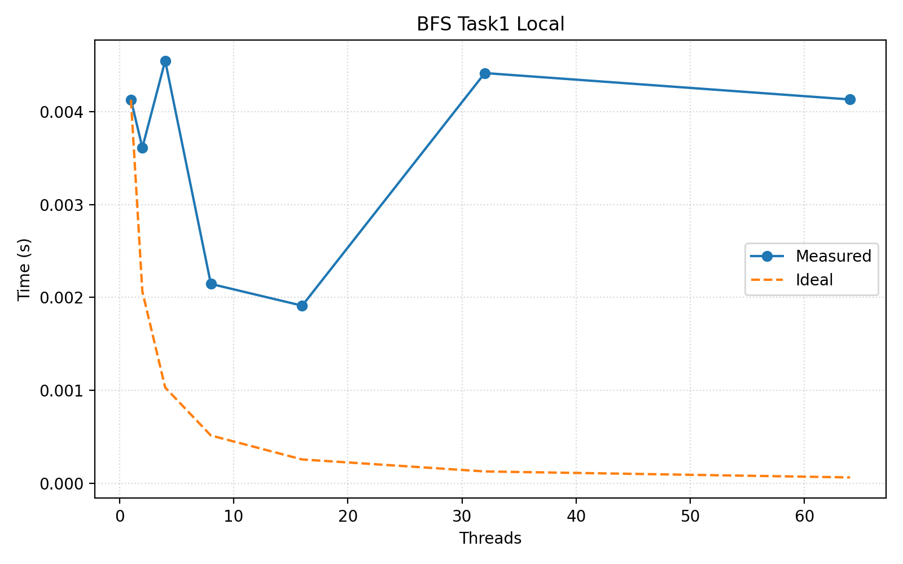

School cluster:

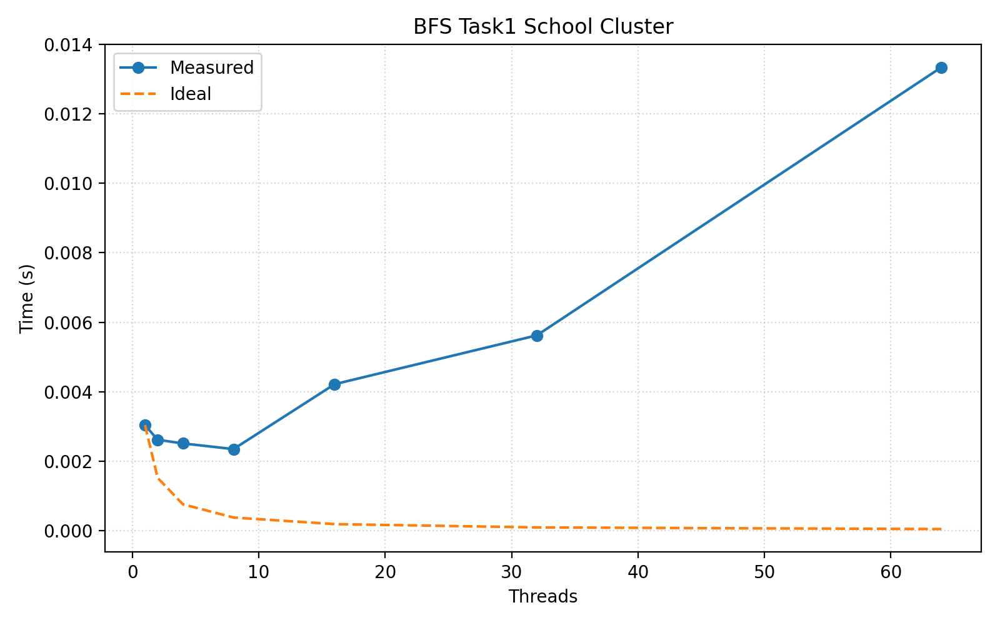

Dardel:

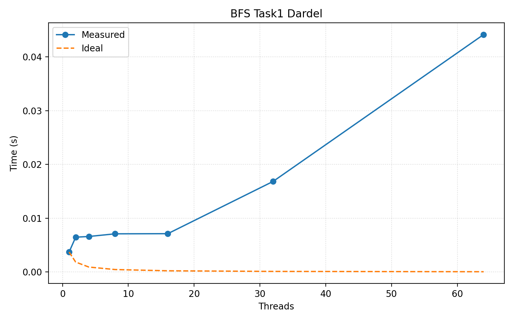

#### Analysis

- At this graph size, runtimes are very short (millisecond-level), so measurement noise and runtime overhead are significant.
- The local and school cluster runs show only modest gains at low thread counts and degrade at higher thread counts.
- Dardel results decrease with thread count in this run, indicating overhead dominates computation for this workload size.
- For more stable BFS scaling conclusions, a larger graph (e.g., `N >= 200000`) and repeated runs per point are recommended.

### Task 2: `bfs_omp_task()`

In this task, we implemented BFS using an OpenMP task-based model. The traversal remains level-synchronous, but each frontier chunk is processed as a separate OpenMP task.

#### Work-sharing and shared-structure handling

- A `single` region creates tasks for frontier chunks (`chunk=64`).
- Each task expands a subset of frontier vertices and writes discovered nodes to a local dynamic buffer.
- Node discovery uses atomic CAS (`__sync_bool_compare_and_swap`) on `dist[]` to guarantee one-time visitation.
- Task-local discovered vertices are merged into the global next frontier via atomic offset reservation.

#### Optimization attempts

1. **Task chunking** (`chunk=64`) to balance overhead and scheduling granularity.
2. **Task-local append buffers** to reduce synchronization overhead on global frontier writes.
3. **CAS-based distance marking** to avoid coarse locks and keep visitation correctness.

#### Task 2 strong-scaling results (time in seconds)

Current test configuration: random graph with `N=50000`, `degree=8`.

| Threads | Local Time | Local Speedup | School Time | School Speedup | Dardel Time | Dardel Speedup |
| ---: | ---: | ---: | ---: | ---: | ---: | ---: |
| 1 | 0.003743 | 1.0000 | 0.003100 | 1.0000 | 0.003412 | 1.0000 |
| 2 | 0.004317 | 0.8670 | 0.002931 | 1.0577 | 0.006907 | 0.4940 |
| 4 | 0.005803 | 0.6450 | 0.002015 | 1.5385 | 0.004974 | 0.6860 |
| 8 | 0.005162 | 0.7251 | 0.002398 | 1.2927 | 0.005961 | 0.5724 |
| 16 | 0.003274 | 1.1433 | 0.006053 | 0.5121 | 0.006460 | 0.5282 |
| 32 | 0.003658 | 1.0232 | 0.013892 | 0.2231 | 0.012846 | 0.2656 |
| 64 | 0.007568 | 0.4946 | 0.030431 | 0.1019 | 0.030204 | 0.1130 |

#### Task 2 plots: measured strong scaling + ideal scaling (dashed)

Local:

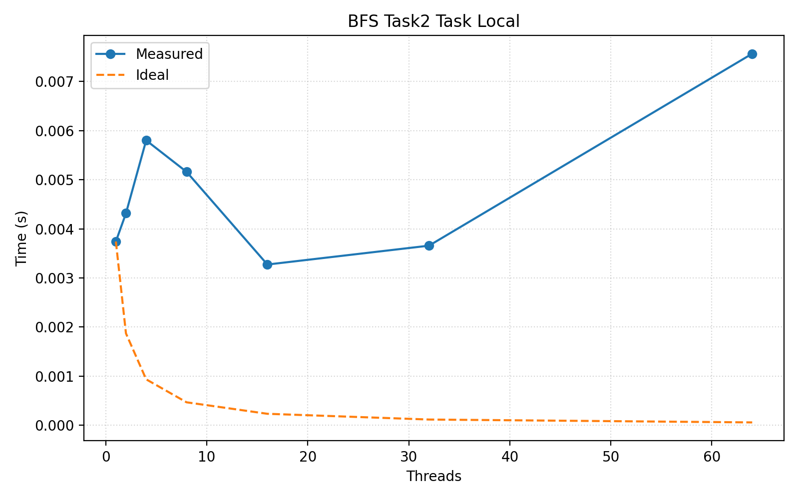

School cluster:

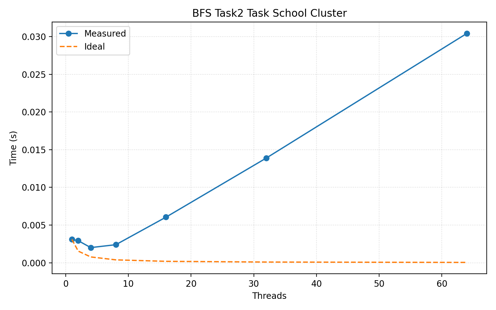

Dardel:

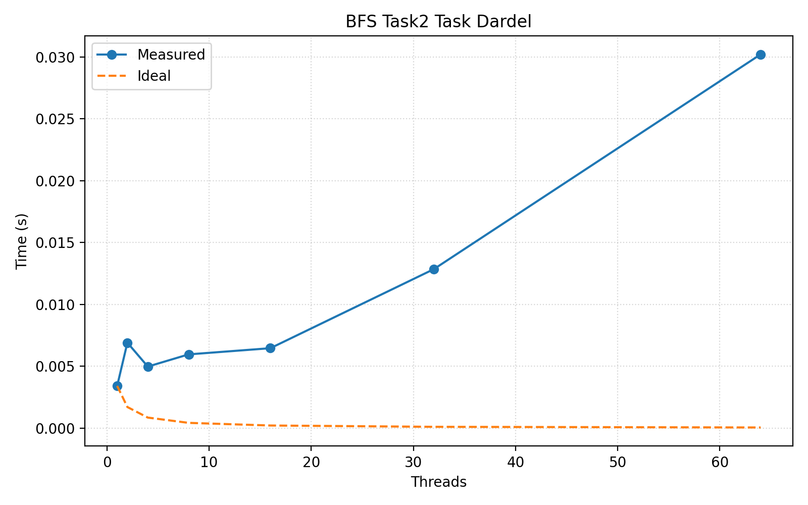

#### Analysis

- The task model does not provide consistent speedup at this problem size; overhead dominates quickly at higher thread counts.
- The school cluster shows some gain at 2-8 threads, but performance drops significantly after 16 threads.
- Local and Dardel results show similar trends, with speedup below 1 for many thread counts.
- Compared with Task 1, this task-based implementation has higher scheduling overhead for small frontiers and short runtimes.
- Larger graph sizes and repeated measurements are required for meaningful scalability comparison between fork-join and task models.

### Task 3: Re-run Scalability with Random Graph Generator

For Task 1 and Task 2, we used the same CSR-based random graph generator with a smaller workload (`N=50000`, `degree=8`). For Task 3, we re-ran the tests using the random graph generator configuration required by the assignment, increasing the graph to `N=200000` and `degree=16` to reduce measurement noise.

#### `bfs_omp_parallel()` on Dardel and school cluster

| Threads | School Time | School Speedup | Dardel Time | Dardel Speedup |
| ---: | ---: | ---: | ---: | ---: |
| 1 | 0.039663 | 1.0000 | 0.042010 | 1.0000 |
| 2 | 0.017163 | 2.3110 | 0.071984 | 0.5836 |
| 4 | 0.010067 | 3.9399 | 0.038895 | 1.0801 |
| 8 | 0.007207 | 5.5034 | 0.028165 | 1.4916 |
| 16 | 0.007577 | 5.2347 | 0.051064 | 0.8227 |
| 32 | 0.009087 | 4.3648 | 0.015838 | 2.6525 |
| 64 | 0.015649 | 2.5345 | 0.019491 | 2.1554 |

School cluster:

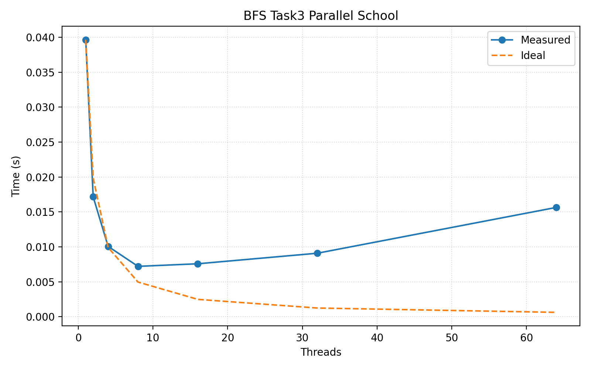

Dardel:

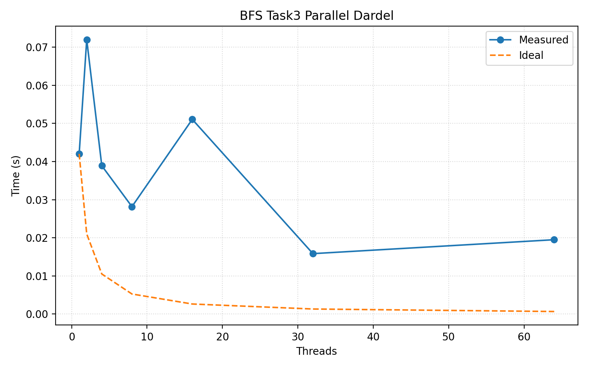

#### `bfs_omp_task()` on Dardel and school cluster

| Threads | School Time | School Speedup | Dardel Time | Dardel Speedup |
| ---: | ---: | ---: | ---: | ---: |
| 1 | 0.023163 | 1.0000 | 0.035580 | 1.0000 |
| 2 | 0.017710 | 1.3079 | 0.048543 | 0.7330 |
| 4 | 0.011798 | 1.9633 | 0.027795 | 1.2801 |
| 8 | 0.008234 | 2.8131 | 0.019502 | 1.8244 |
| 16 | 0.017196 | 1.3470 | 0.037761 | 0.9422 |
| 32 | 0.038963 | 0.5945 | 0.030446 | 1.1686 |
| 64 | 0.271393 | 0.0853 | 0.059229 | 0.6007 |

School cluster:

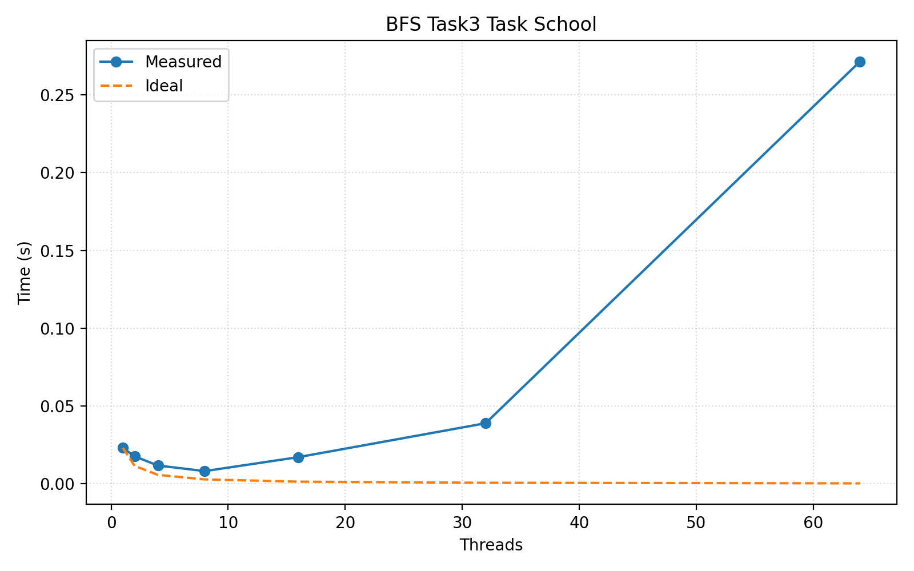

Dardel:

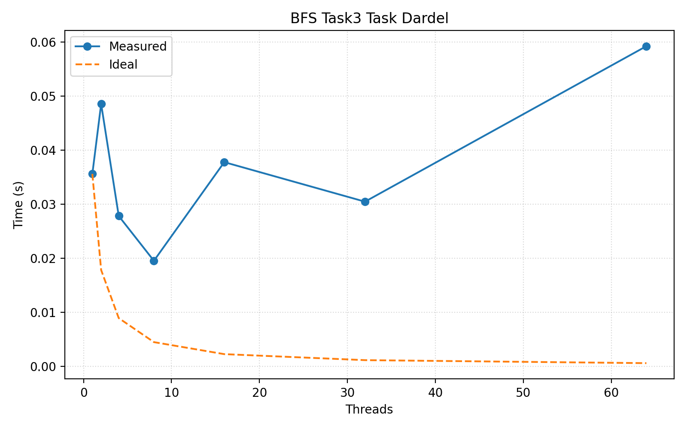

#### Modifications and performance notes

- We increased random-graph workload size (`N=200000`, `degree=16`) compared with previous runs to reduce timer noise.
- The fork-join parallel BFS (`bfs_omp_parallel`) shows clearer scaling on the school cluster up to around 8-16 threads, then degrades.
- The task-based BFS (`bfs_omp_task`) improves up to moderate thread counts but drops sharply at high thread counts, especially on the school cluster, due to task scheduling and synchronization overhead.
- On Dardel, both methods show non-monotonic behavior, suggesting shared-node/runtime noise remains a significant factor.
- Overall, for this workload, `bfs_omp_parallel()` is more stable and generally preferable to the task model.

---

## Exercise 3 - Parallelization of Shallow Water Simulation

We implemented a 2D shallow-water solver with OpenMP parallelization in `shallow_water_ex3.c`.

#### Implementation highlights

- Grid arrays `h`, `u`, `v` are stored as 1D contiguous buffers for cache-friendly access.
- Initialization uses:
  - `#pragma omp parallel for collapse(2) schedule(static)`
- Time-step update loop uses:
  - `#pragma omp parallel for collapse(2) schedule(runtime)`
- Runtime schedule is selected via `omp_set_schedule(...)` from command-line argument:
  - `static`, `dynamic`, or `guided`.
- Timing is measured with `omp_get_wtime()` around the full iteration loop.

#### Build and run commands

```bash
gcc -O3 -fopenmp -march=native shallow_water_ex3.c -o shallow_water_ex3
chmod +x run_scaling_shallow.sh
./run_scaling_shallow.sh 500 1000 static  scaling_local_ex3_static.csv  ./shallow_water_ex3
./run_scaling_shallow.sh 500 1000 dynamic scaling_local_ex3_dynamic.csv ./shallow_water_ex3
./run_scaling_shallow.sh 500 1000 guided  scaling_local_ex3_guided.csv  ./shallow_water_ex3
```

#### Strong-scaling results (time in seconds)

##### Static schedule

| Threads | Local Time | Local Speedup | School Time | School Speedup | Dardel Time | Dardel Speedup |
| ---: | ---: | ---: | ---: | ---: | ---: | ---: |
| 1 | 0.394166 | 1.0000 | 0.420285 | 1.0000 | 0.815274 | 1.0000 |
| 2 | 0.331171 | 1.1902 | 0.359546 | 1.1689 | 1.887314 | 0.4320 |
| 4 | 0.281527 | 1.4001 | 0.272370 | 1.5431 | 2.249672 | 0.3624 |
| 8 | 0.324668 | 1.2141 | 0.167627 | 2.5073 | 1.466708 | 0.5559 |
| 16 | 0.367380 | 1.0729 | 0.096643 | 4.3488 | 0.873912 | 0.9329 |
| 32 | 0.455585 | 0.8652 | 0.125296 | 3.3543 | 0.425920 | 1.9141 |
| 64 | 0.679019 | 0.5805 | 0.274687 | 1.5301 | 0.294690 | 2.7665 |

##### Dynamic schedule

| Threads | Local Time | Local Speedup | School Time | School Speedup | Dardel Time | Dardel Speedup |
| ---: | ---: | ---: | ---: | ---: | ---: | ---: |
| 1 | 0.503201 | 1.0000 | 0.531112 | 1.0000 | 1.005229 | 1.0000 |
| 2 | 0.555974 | 0.9051 | 0.758833 | 0.6999 | 2.575379 | 0.3903 |
| 4 | 0.510852 | 0.9850 | 0.700704 | 0.7580 | 1.725442 | 0.5826 |
| 8 | 0.519483 | 0.9687 | 0.906053 | 0.5862 | 1.363631 | 0.7372 |
| 16 | 0.425200 | 1.1834 | 0.561702 | 0.9455 | 1.429911 | 0.7030 |
| 32 | 0.493041 | 1.0206 | 0.802926 | 0.6615 | 0.976453 | 1.0295 |
| 64 | 0.610727 | 0.8239 | 1.747704 | 0.3039 | 0.796201 | 1.2625 |

##### Guided schedule

| Threads | Local Time | Local Speedup | School Time | School Speedup | Dardel Time | Dardel Speedup |
| ---: | ---: | ---: | ---: | ---: | ---: | ---: |
| 1 | 0.410918 | 1.0000 | 0.426185 | 1.0000 | 0.856015 | 1.0000 |
| 2 | 0.237341 | 1.7313 | 0.224033 | 1.9023 | 0.899527 | 0.9516 |
| 4 | 0.154515 | 2.6594 | 0.123063 | 3.4631 | 0.846904 | 1.0108 |
| 8 | 0.256966 | 1.5991 | 0.073338 | 5.8112 | 0.693219 | 1.2348 |
| 16 | 0.091799 | 4.4763 | 0.057003 | 7.4765 | 0.401285 | 2.1332 |
| 32 | 0.378929 | 1.0844 | 0.070694 | 6.0286 | 0.259422 | 3.2997 |
| 64 | 0.439642 | 0.9347 | 0.328896 | 1.2958 | 0.212444 | 4.0294 |

#### Plots

Local:

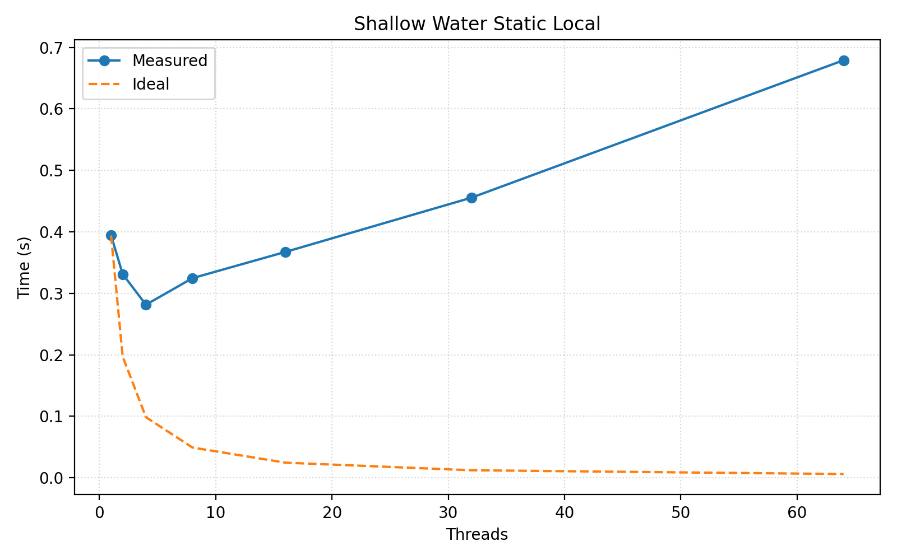
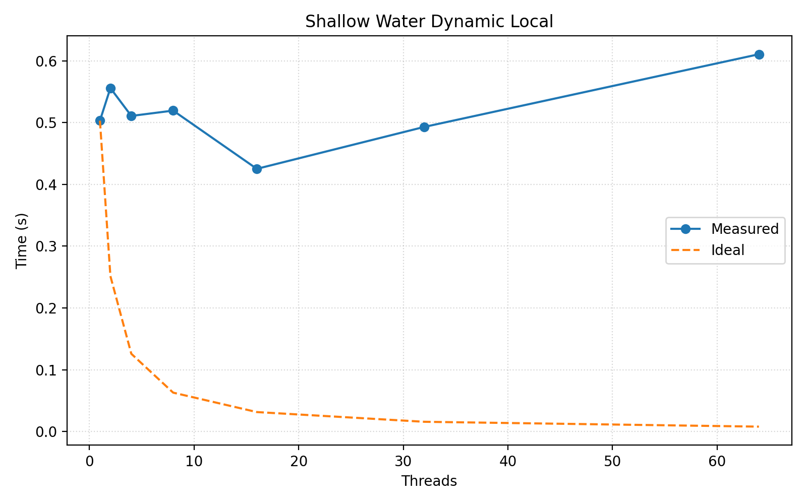
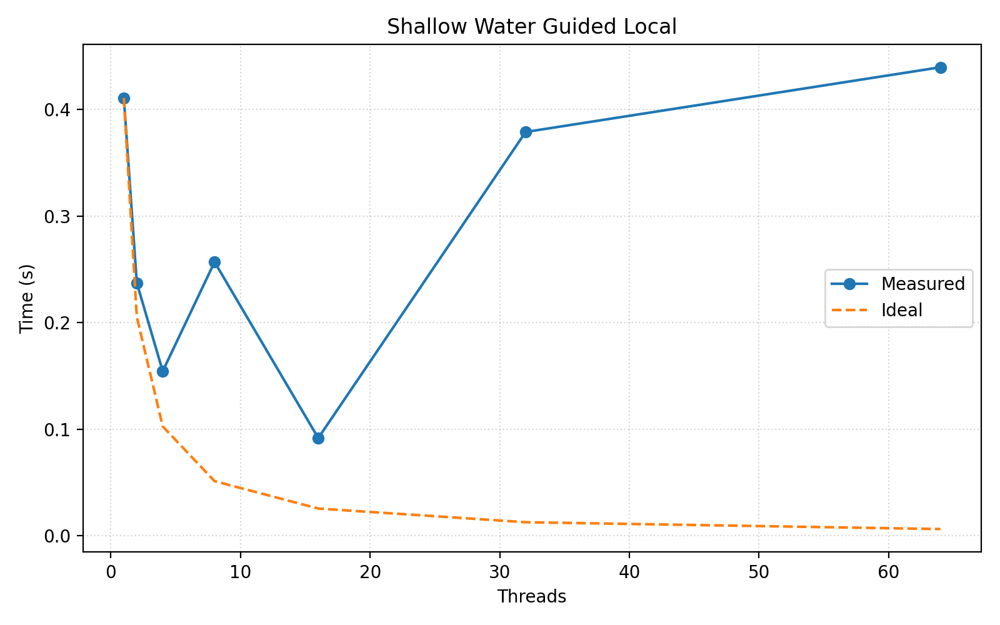

School cluster:

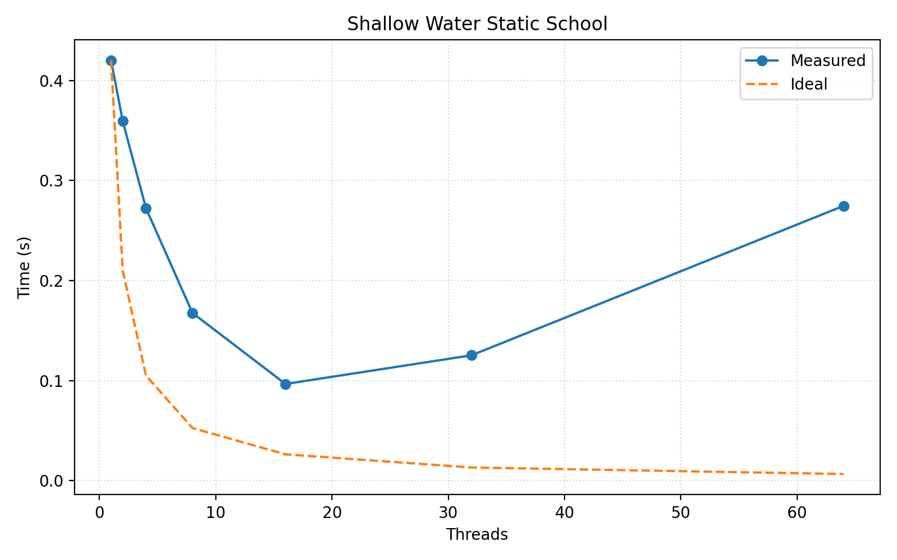
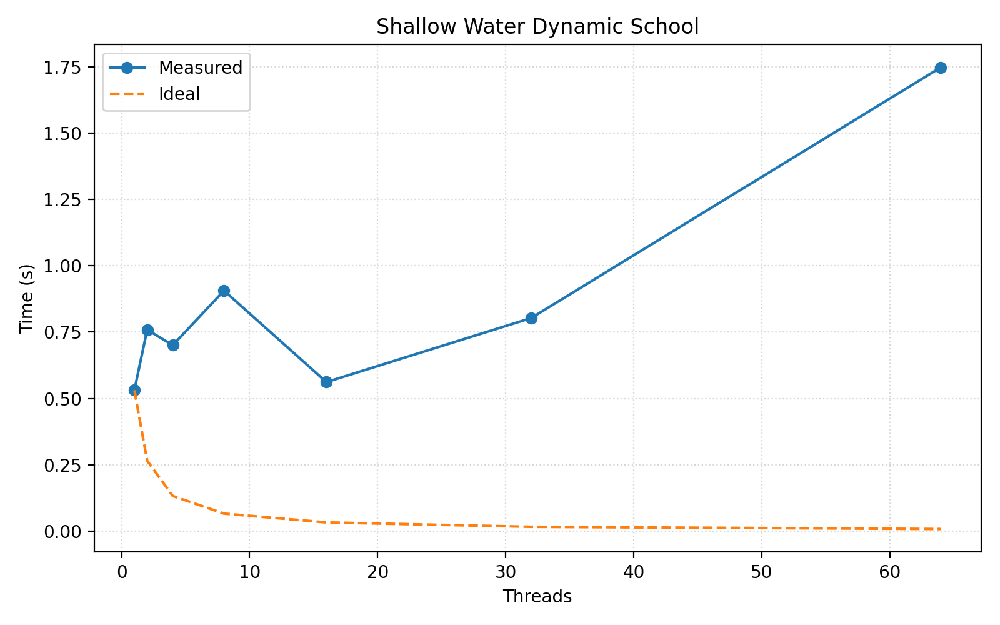
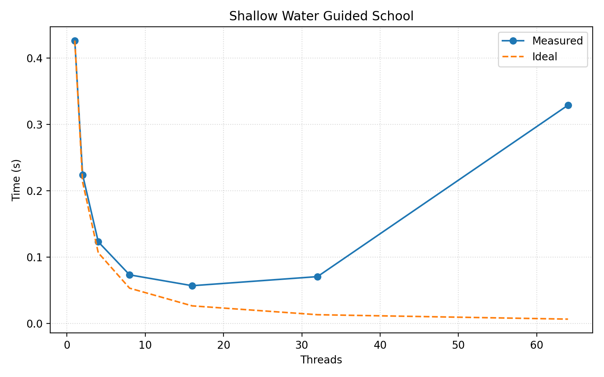

Dardel:

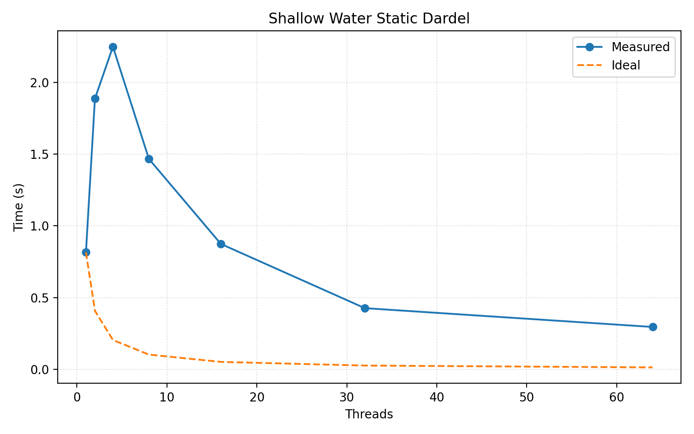
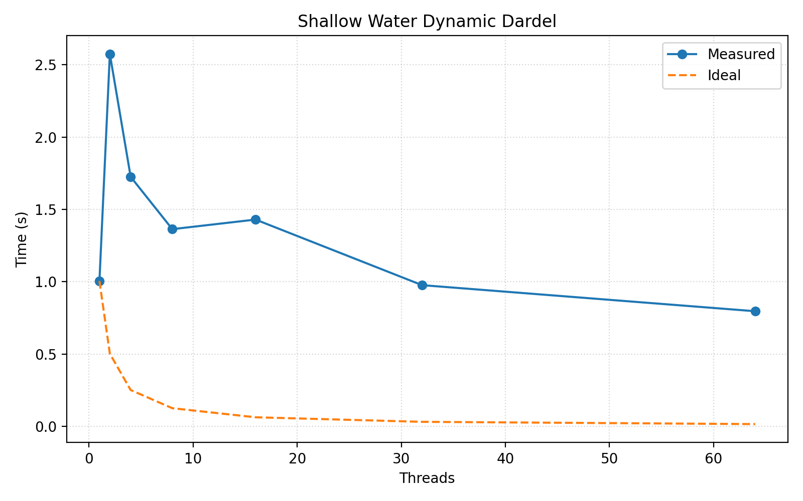
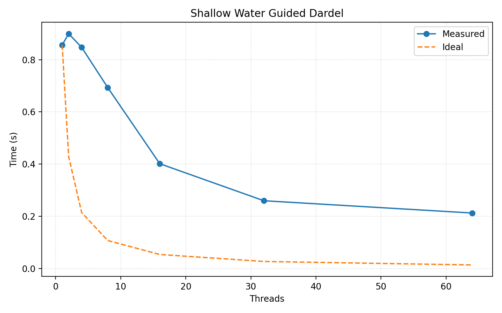

#### Analysis

- **Guided scheduling** performs best overall in these runs, especially on school cluster and Dardel, indicating better adaptation to runtime imbalance/overhead tradeoffs.
- **Static scheduling** scales moderately on school cluster and Dardel but degrades at very high thread counts due to overhead and memory-system contention.
- **Dynamic scheduling** is consistently the weakest for this workload in our tests, likely due to higher scheduling overhead compared with useful work per chunk.
- On the school cluster, guided reaches the highest speedup (`7.48x` at 16 threads).
- On Dardel, guided shows the best high-thread behavior (`4.03x` at 64 threads).

#### Grid-size impact (16 threads, guided schedule)

To complement the main `N=500` strong-scaling dataset, we also ran a fixed-thread comparison (`OMP_NUM_THREADS=16`, `guided`, `1000` iterations) for `N=500/1000/2000` on all three systems:

| Grid size (`N x N`) | Local Time (s) | School Time (s) | Dardel Time (s) |
| ---: | ---: | ---: | ---: |
| 500 x 500 | 0.122736 | 0.067700 | 0.139040 |
| 1000 x 1000 | 0.241351 | 0.163830 | 0.517949 |
| 2000 x 2000 | 5.862118 | 0.802682 | 4.621511 |

The runtime increases significantly with grid size, especially from `N=1000` to `N=2000`, which is expected due to rapidly growing memory traffic and stencil-update work per step. This small table also highlights that absolute times depend strongly on hardware and runtime environment (CPU model, frequency behavior, memory subsystem, and node configuration), so we focus cross-system comparison on trends rather than raw seconds.

#### Output visualization

We generated `output_*.txt` snapshots during scaling runs. The resulting water height field can be visualized using:

```python
import numpy as np
import matplotlib.pyplot as plt

data = np.loadtxt("output_static_64.txt")
plt.imshow(data, cmap="viridis", origin="lower")
plt.colorbar(label="Water Height")
plt.title("Shallow Water Simulation Result")
plt.show()
```

An example rendered result is shown below:

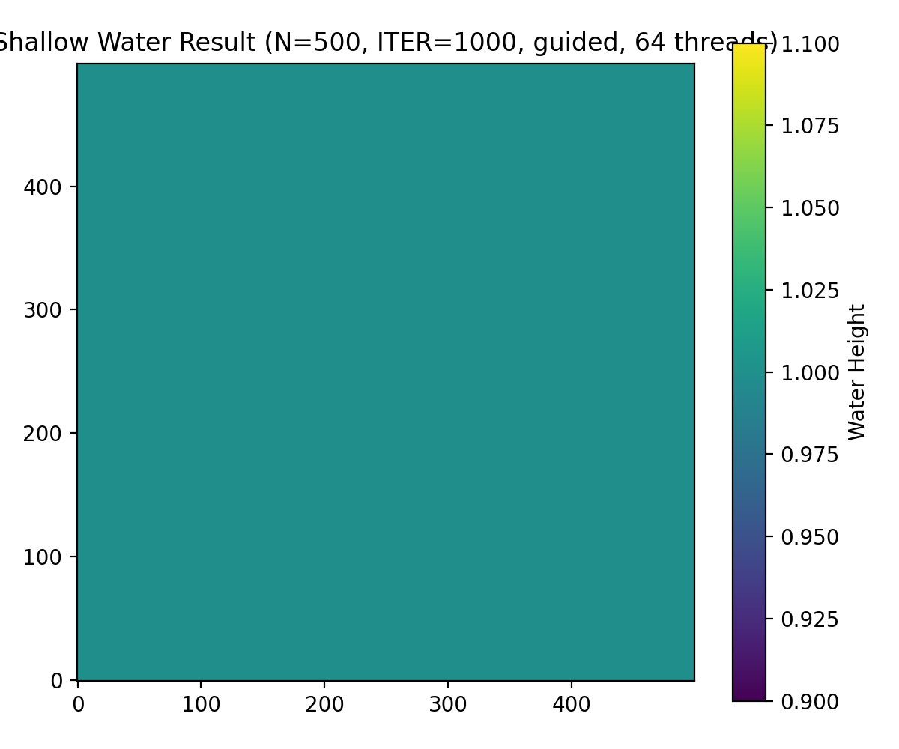

---

## Bonus Exercise: Simulating Neurons with OpenMP Tasks

We implemented an integrate-and-fire neuron simulation in `Bonus/neuron_omp_task.c` and parallelized neuron updates using OpenMP tasks (`taskloop`).

### Implementation summary

- Each neuron state (`potential`, `firing count`, RNG state) is independent in each simulation step.
- In task mode, per-step updates are parallelized with:
  - `#pragma omp parallel`
  - `#pragma omp single nowait`
  - `#pragma omp taskloop grainsize(256)`
- This keeps task-based decomposition while reducing excessive overhead from creating one tiny task per neuron.
- We support `serial` mode (baseline) and `task` mode (parallel), with optional activity logging.

### Run and scaling commands

```bash
cd Bonus
gcc -O3 -fopenmp -march=native neuron_omp_task.c -o neuron_omp_task
chmod +x run_scaling_neuron.sh run_bonus_oneclick.sh
./run_bonus_oneclick.sh
```

The one-click script generates:

- `scaling_bonus_neuron_task.csv`
- `strong_scaling_bonus_neuron_task.png`
- `neuron_activity_scatter.png`
- `neuron_firing_hist.png`
- `Screenshots_bonus/` (code/compile/max-thread screenshots)

### Bonus strong-scaling results (school cluster run)

| Threads | Time (s) | Speedup | Efficiency |
| ---: | ---: | ---: | ---: |
| 1 | 0.056113 | 1.0000 | 1.0000 |
| 2 | 0.117239 | 0.4786 | 0.2393 |
| 4 | 0.087471 | 0.6415 | 0.1604 |
| 8 | 0.170154 | 0.3298 | 0.0412 |
| 16 | 0.101059 | 0.5553 | 0.0347 |
| 32 | 0.211671 | 0.2651 | 0.0083 |
| 64 | 0.283715 | 0.1978 | 0.0031 |

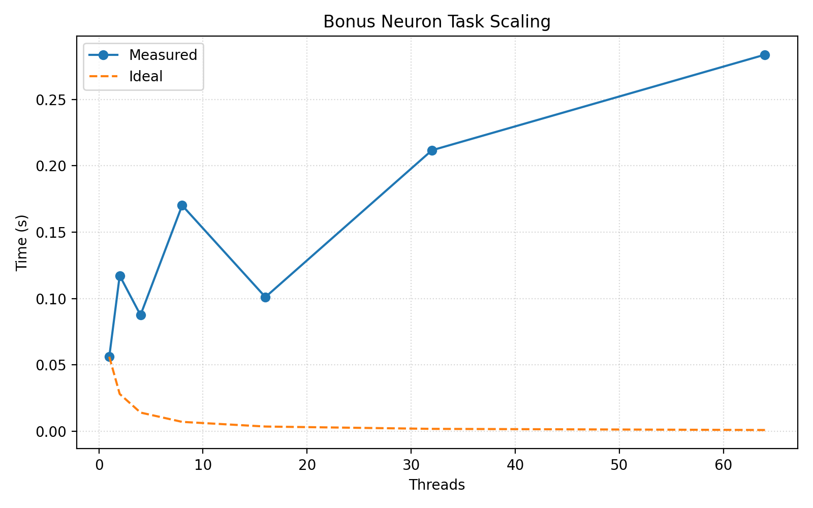

### Neuron activity visualization

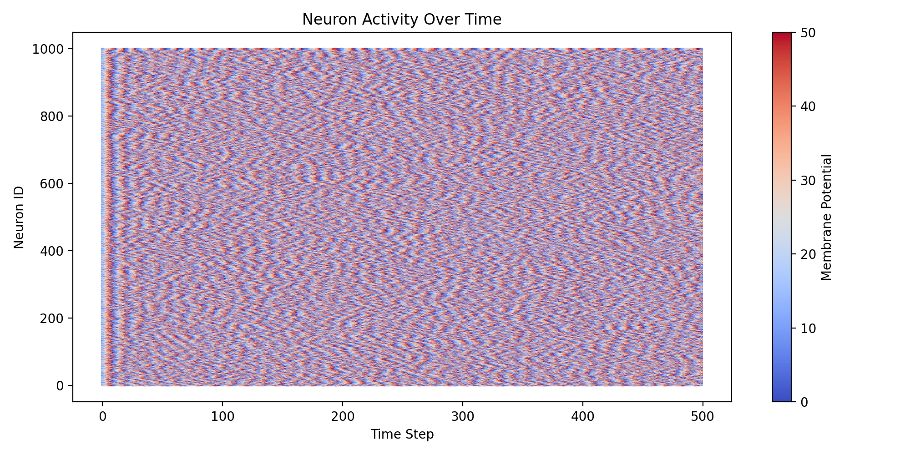

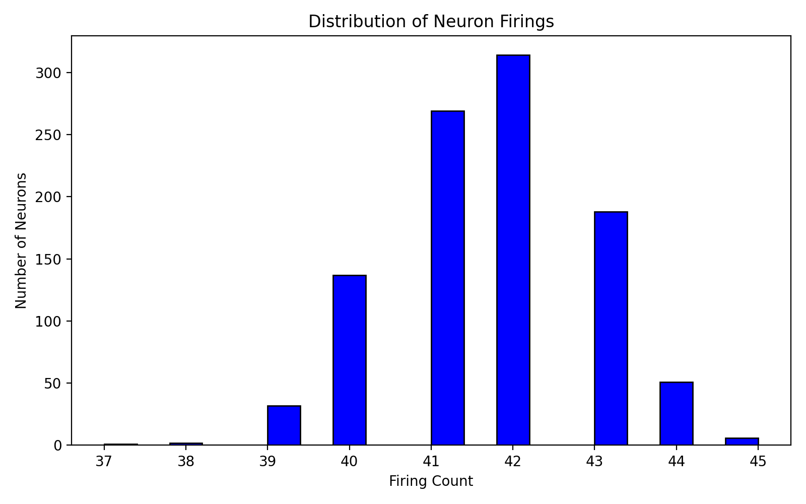

From `neuron_summary_task.txt` (1000 neurons), observed firing statistics are:

- Min firing count: `37`
- Max firing count: `45`
- Mean firing count: `41.656`

### Answers to the bonus questions

1. **How does task parallelism differ from loop parallelism?**  
   Loop parallelism (`omp for`) partitions a known loop iteration space with relatively low overhead. Task parallelism (`omp task`/`taskloop`) expresses work as dynamic units and is more flexible for irregular workloads, but usually has higher scheduling overhead.

2. **How can task dependencies be introduced to simulate neural connections?**  
   If neuron updates depend on other neurons' spikes, tasks can use explicit dependencies (e.g., `depend(in: ...)`, `depend(out: ...)`) or two-phase updates (compute spikes first, then propagate). This preserves causal ordering while allowing parallel execution.

3. **What happens to performance as the number of neurons increases?**  
   For small workloads, task overhead can dominate and scaling may be poor. As neuron count grows, computation per task increases and parallel efficiency typically improves until memory/synchronization bottlenecks dominate.

4. **How does varying the firing threshold affect overall neuron activity?**  
   Lower threshold leads to more frequent firing and resets; higher threshold reduces firing frequency and increases average membrane potential. Therefore threshold controls event density and activity patterns.

---

## Appendix: Reproducibility Files

Core documentation:

- `README.md`: explains how to compile and run each question.
- `Exercise 1/README.md`, `Exercise 2/README.md`, `Exercise 3/README.md`: per-exercise compile/run instructions.

Currently completed reproducibility files for Exercise 1:

- Task 1 (`parallel for`):
  - `matmul_ex1_task1.c`
  - `scaling_local.csv`, `scaling_school.csv`, `scaling_dardel.csv`
  - `strong_scaling_local.png`, `strong_scaling_school.png`, `strong_scaling_dardel.png`
- Task 2 (`simd`):
  - `matmul_ex1_task2_simd.c`
  - `scaling_local_task2_simd.csv`, `scaling_school_task2_simd.csv`, `scaling_dardel_task2_simd.csv`
  - `strong_scaling_local_task2_simd.png`, `strong_scaling_school_task2_simd.png`, `strong_scaling_dardel_task2_simd.png`
- Task 3 (`parallel + simd`):
  - `matmul_ex1_task3_hybrid.c`
  - `scaling_local_task3_hybrid.csv`, `scaling_school_task3_hybrid.csv`, `scaling_dardel_task3_hybrid.csv`
  - `strong_scaling_local_task3_hybrid.png`, `strong_scaling_school_task3_hybrid.png`, `strong_scaling_dardel_task3_hybrid.png`
- Task 4 (`target` + fallback):
  - `matmul_ex1_task4_gpu.c`
  - `scaling_local_task4_gpu.csv`, `scaling_school_task4_gpu.csv`, `scaling_dardel_task4_gpu.csv`
  - `strong_scaling_local_task4_gpu.png`, `strong_scaling_school_task4_gpu.png`, `strong_scaling_dardel_task4_gpu.png`
- Exercise 2 Task 1 (`bfs_omp_parallel`):
  - `bfs_ex2_task1_parallel.c`
  - `scaling_local_ex2_task1_bfs.csv`, `scaling_school_ex2_task1_bfs.csv`, `scaling_dardel_ex2_task1_bfs.csv`
  - `strong_scaling_local_ex2_task1_bfs.png`, `strong_scaling_school_ex2_task1_bfs.png`, `strong_scaling_dardel_ex2_task1_bfs.png`
- Exercise 2 Task 2 (`bfs_omp_task`):
  - `bfs_ex2_task2_task.c`
  - `scaling_local_ex2_task2_bfs_task.csv`, `scaling_school_ex2_task2_bfs_task.csv`, `scaling_dardel_ex2_task2_bfs_task.csv`
  - `strong_scaling_local_ex2_task2_bfs_task.png`, `strong_scaling_school_ex2_task2_bfs_task.png`, `strong_scaling_dardel_ex2_task2_bfs_task.png`
- Exercise 2 Task 3 (random-graph rerun):
  - `run_scaling_bfs.sh`
  - `scaling_local_ex2_task3_bfs_parallel.csv`, `scaling_school_ex2_task3_bfs_parallel.csv`, `scaling_dardel_ex2_task3_bfs_parallel.csv`
  - `scaling_local_ex2_task3_bfs_task.csv`, `scaling_school_ex2_task3_bfs_task.csv`, `scaling_dardel_ex2_task3_bfs_task.csv`
  - `strong_scaling_local_ex2_task3_bfs_parallel.png`, `strong_scaling_school_ex2_task3_bfs_parallel.png`, `strong_scaling_dardel_ex2_task3_bfs_parallel.png`
  - `strong_scaling_local_ex2_task3_bfs_task.png`, `strong_scaling_school_ex2_task3_bfs_task.png`, `strong_scaling_dardel_ex2_task3_bfs_task.png`
- Exercise 3 (shallow water):
  - `shallow_water_ex3.c`
  - `run_scaling_shallow.sh`
  - `scaling_local_ex3_static.csv`, `scaling_local_ex3_dynamic.csv`, `scaling_local_ex3_guided.csv`
  - `scaling_school_ex3_static.csv`, `scaling_school_ex3_dynamic.csv`, `scaling_school_ex3_guided.csv`
  - `scaling_dardel_ex3_static.csv`, `scaling_dardel_ex3_dynamic.csv`, `scaling_dardel_ex3_guided.csv`
  - `strong_scaling_local_ex3_static.png`, `strong_scaling_local_ex3_dynamic.png`, `strong_scaling_local_ex3_guided.png`
  - `strong_scaling_school_ex3_static.png`, `strong_scaling_school_ex3_dynamic.png`, `strong_scaling_school_ex3_guided.png`
  - `strong_scaling_dardel_ex3_static.png`, `strong_scaling_dardel_ex3_dynamic.png`, `strong_scaling_dardel_ex3_guided.png`
- Bonus (neuron simulation with OpenMP tasks):
  - `Bonus/neuron_omp_task.c`
  - `Bonus/run_scaling_neuron.sh`, `Bonus/run_bonus_oneclick.sh`
  - `Bonus/scaling_bonus_neuron_task.csv`
  - `Bonus/strong_scaling_bonus_neuron_task.png`
  - `Bonus/neuron_output_task.txt`, `Bonus/neuron_summary_task.txt`
  - `Bonus/neuron_activity_scatter.png`, `Bonus/neuron_firing_hist.png`
  - `Bonus/Screenshots_bonus/bonus_code.png`, `Bonus/Screenshots_bonus/bonus_compile.png`
  - `Bonus/Screenshots_bonus/bonus_maxthreads.png`, `Bonus/Screenshots_bonus/bonus_correctness_run.png`
- Shared scripts:
  - `run_scaling.sh`
  - `plot_scaling.py`

