# 作业 4：使用 MPI 的分布式内存编程

<div align="center">
  <strong>Jinye Gong（龚金烨）</strong><br>
  jinyeg@kth.se<br><br>
  <strong>Weiyi Lyu（吕惟怡）</strong><br>
  weiyil@kth.se<br><br>
  <strong>2026-05-20</strong>
</div>

## 分工说明

本作业由两名组员共同完成。

- **Weiyi Lyu**：Dardel 环境配置（`edu26.dd2356`）、目录结构、Slurm 脚本及 Dardel 主要实验；练习 1 实现与强扩展实验；报告结构与 MPI 相关章节。
- **Jinye Gong**：学校集群实验；练习 2、练习 3 实现；正确性验证与 Python 可视化；弱扩展/并行效率测量；报告整合。

双方在算法设计、结果核对、绘图与报告撰写中均有贡献。

## AI 辅助声明

AI 工具用于 Markdown 排版、章节结构与语言润色。

所有实现、命令执行、性能测量、结果收集、绘图与技术结论均由作者完成并核对。

## 截图证据索引

截图（代码、编译、最大规模运行）位于 `Artifacts/screenshots/school/` 与 `Artifacts/screenshots/dardel/`（练习 1–2 含 Dardel；练习 3 按作业要求仅学校集群）。

| 练习 | 学校集群 | Dardel |
| --- | --- | --- |
| Ex1 波动方程 | `ex1_*.png` | `ex1_*.png` |
| Ex2 行求和 | `ex2_*.png` | `ex2_*.png` |
| Ex3 生命游戏 | `ex3_*.png` | — |

Score-P（Dardel，Ex1–2，np=16）：已完成，使用 `score-p/9.4-cpeCray-24.11`；指标见练习 1–2 第 7 节。

---

## 练习 1 — 波动方程模拟中的一维 Halo 交换

### 1. 实现

我们在 `Exercise 1/wave_mpi.c` 中基于 **一维域分解** 与 **点对点 halo 交换** 并行化了一维显式波动方程求解器。

#### 并行化策略

1. 将规模为 `N` 的全局网格划分到 `P` 个 MPI 进程。
   - 本地规模：`local_n = N / P`，余数分配给前 `N % P` 个 rank。
   - 每个 rank 拥有全局坐标中的连续区间 `[start, end)`。
2. 为 `u`、`u_prev`、`u_next` 分配带 **左右各一个 ghost 单元** 的本地数组。
3. 每个时间步：
   - 使用 `MPI_Send` / `MPI_Recv`（或等价方式）与邻居交换 ghost 值。
   - 左边界：rank `0` 使用固定边界值；右边界：rank `P-1` 同理。
   - 用有限差分模板更新内点 `i = 1 .. local_n`。
4. 计时：在主循环外用 `MPI_Wtime()`，之前使用 `MPI_Barrier(MPI_COMM_WORLD)`。
5. I/O：仅 rank `0` 在收集全局场后写入 `wave_output_*.txt`（用于正确性图）。测量扩展性时关闭 I/O。

核心 halo 交换模式（示意）：

```c
/* After local compute setup, each step: */
if (rank > 0) {
    MPI_Send(&u[1], 1, MPI_DOUBLE, rank - 1, 0, MPI_COMM_WORLD);
    MPI_Recv(&u[0], 1, MPI_DOUBLE, rank - 1, 1, MPI_COMM_WORLD, MPI_STATUS_IGNORE);
}
if (rank < nprocs - 1) {
    MPI_Send(&u[local_n], 1, MPI_DOUBLE, rank + 1, 1, MPI_COMM_WORLD);
    MPI_Recv(&u[local_n + 1], 1, MPI_DOUBLE, rank + 1, 0, MPI_COMM_WORLD, MPI_STATUS_IGNORE);
}
```

设计要点：

- Ghost 单元保存邻居值，供三点空间模板使用。
- 每步同步确保所有 rank 在更新 `u_next` 前 halo 一致。
- 强扩展保持 **全局 `N` 固定**，增加 `P`。

#### 实验参数

| 设置 | 正确性 / 绘图 | 扩展性实验 |
| --- | --- | --- |
| `N` | 1000（默认） | 如 100000（扩展性可增大） |
| `STEPS` | 100 | 如 1000 |
| I/O | 每 10 步 | 关闭 |

### 2. 编译与运行命令

#### 学校集群

```bash
cd ~/dd2356_a4/Exe1
mpicc -O3 -o wave_mpi wave_mpi.c -lm
chmod +x run_school_ex1.sh run_scaling_strong.sh
./run_school_ex1.sh
```

编译命令：**`mpicc -O3 -o wave_mpi wave_mpi.c -lm`**

运行命令（扩展性）：**`mpirun -np <np> ./wave_mpi`**，并设置 `WAVE_N=200000 WAVE_STEPS=500 WAVE_IO=0`

#### Dardel

```bash
cd ~/DD2356/assignment4
source scripts/dardel_setup_env.sh
cd "Exercise 1"
cc -O3 -o wave_mpi wave_mpi.c -lm

# 交互式（单节点最多 4 个 rank）
salloc -A edu26.dd2356 -N 1 -t 00:30:00 --ntasks-per-node=4
srun -n 4 ./wave_mpi

# 批处理强扩展 np=16（4 节点 × 每节点 4 任务）
cd ~/DD2356/assignment4
mkdir -p logs
sbatch scripts/dardel_run_mpi.slurm 1 16
```

报告用编译命令（Dardel）：在 `module load PDC/24.11 PrgEnv-gnu/8.6.0 cray-mpich/8.1.31` 后执行 **`cc -O3 -o wave_mpi wave_mpi.c -lm`**。

报告用运行命令（Dardel）：在已分配作业内执行 **`srun -n <np> ./wave_mpi`**。

### 3. 正确性验证

我们对比了以下来源的波动输出：

1. **串行基线**（单进程运行或串行参考代码）。
2. **学校集群上的并行 MPI 运行**。

验证方法：

- 用 `plot_wave.py` 绘制 `wave_output_*.txt`，在同一时间步叠加串行与并行曲线。
- 检查串行与并行收集场之间的最大绝对误差（算法一致时应接近机器精度）。

正确性检查（学校集群，`wave_output_0.txt`）：

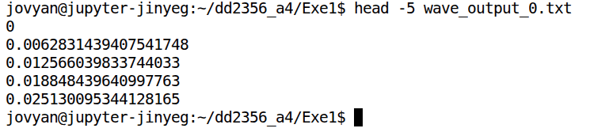

串行与并行波形可视化对比（同一设置：`N=200`、`STEPS=50`、`I/O=1`；串行为 `np=1`，并行为 `np=4`）：

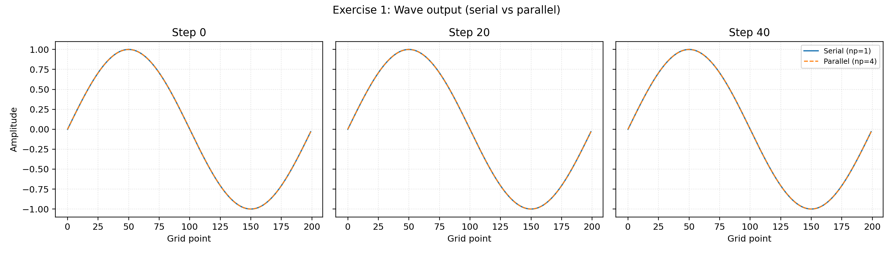

学校集群截图（代码 / 编译 / 运行 / 扩展性）：

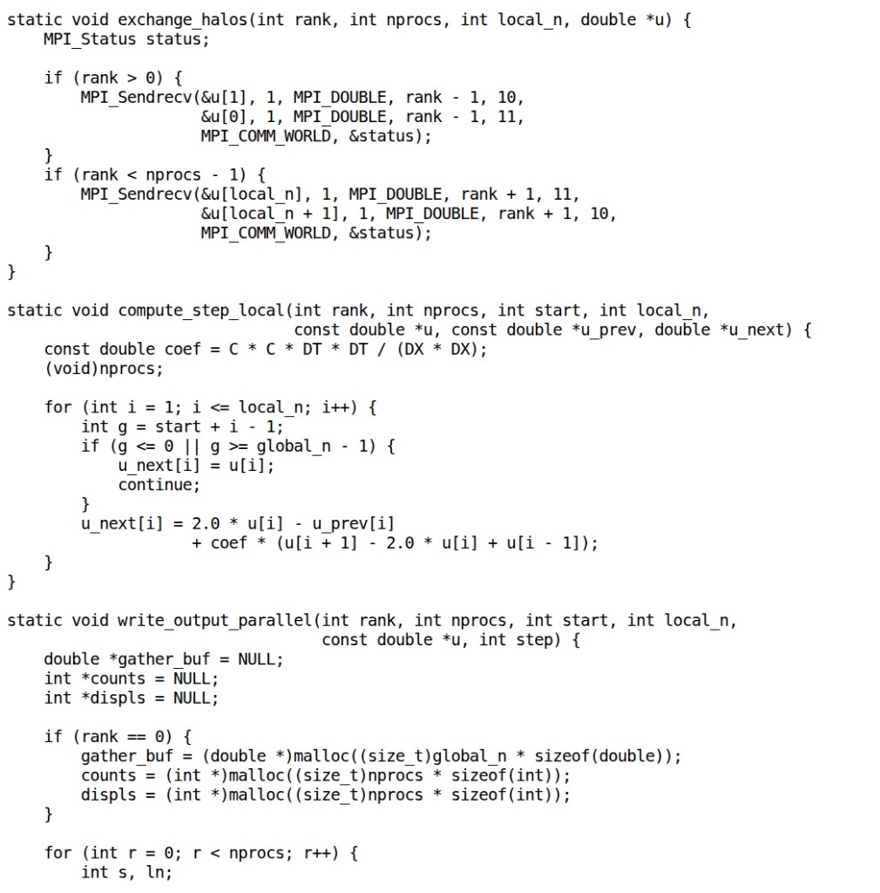

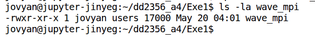

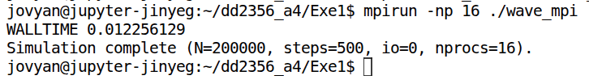

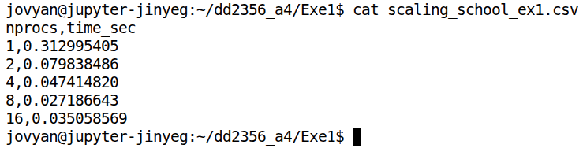

### 4. 强扩展结果（时间，秒）

固定全局规模：**`N = 200000`**；**`STEPS = 500`**；进程数：**`1, 2, 4, 8, 16`**。计时时 **关闭 I/O**（`WAVE_IO=0`）。

| 进程数 | 学校时间 (s) | 学校加速比 | Dardel 时间 (s) | Dardel 加速比 |
| ---: | ---: | ---: | ---: | ---: |
| 1 | 0.3130 | 1.0000 | 0.1447 | 1.0000 |
| 2 | 0.0798 | 3.92 | 0.0738 | 1.96 |
| 4 | 0.0474 | 6.60 | 0.0390 | 3.71 |
| 8 | 0.0272 | 11.51 | 0.0231 | 6.27 |
| 16 | 0.0351 | 8.93 | 0.0144 | 10.01 |

加速比定义：`S(p) = T(1) / T(p)`。  
原始 CSV：`Exercise 1/scaling_school_ex1.csv`、`Exercise 1/scaling_dardel_ex1.csv`。

### 5. 图表：实测强扩展 + 理想扩展（虚线）

学校集群：

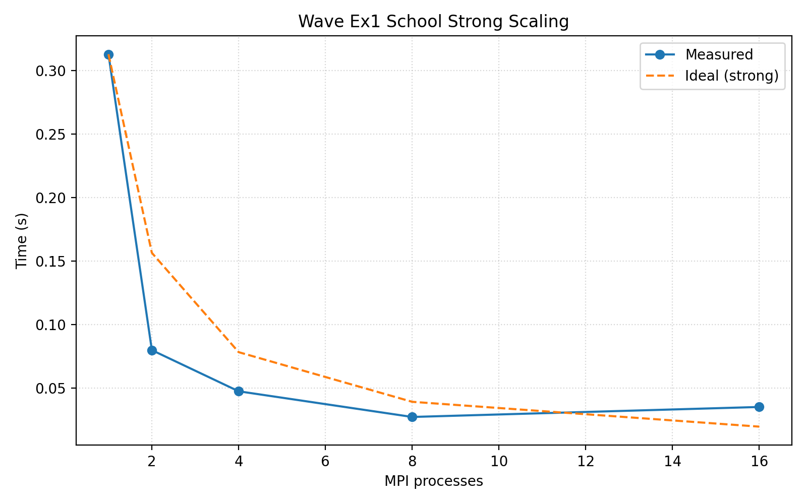

Dardel：

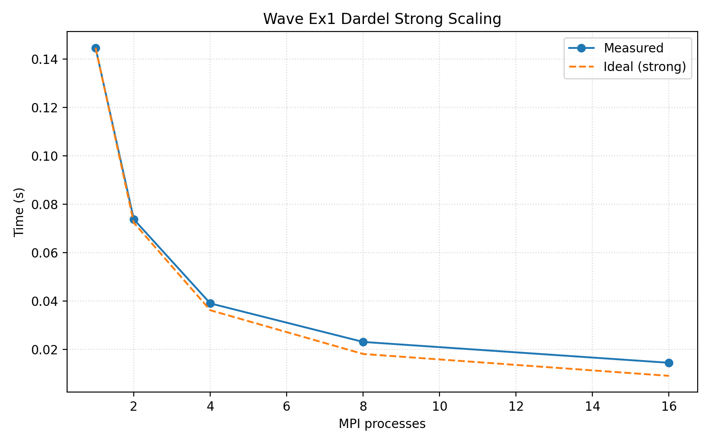

### 6. 性能分析

**学校集群：**

- 从 1 到 8 进程运行时间稳步下降（`0.313s → 0.027s`，8 进程加速比 **11.5×**），说明每 rank 本地计算仍足够大时有较好强扩展。
- **16 进程**时时间回升至 `0.035s`（加速比 **8.9×**，理想为 16×），表明开销占主导：每步 halo 延迟、MPI 启动/同步，以及共享 Jupyter/集群节点上可能的资源争用。
- 16 进程并行效率：`8.93/16 ≈ 56%`。

**Dardel：**

- 直至 **16 进程** 单调改善（`0.145s → 0.014s`，加速比 **10.0×**），最大规模未出现性能回退。
- 高进程数下扩展比学校更平滑；`np=16` 按作业要求使用 **4 节点 × 每节点 4 个 MPI rank**。
- 16 进程效率：`10.01/16 ≈ 63%`；与理想的差距主要来自每步 halo 通信与 barrier。
- 本组数据中 Dardel 在各进程数下均快于学校（如 `T(1)=0.145s` vs `0.313s`），与专用计算节点相对共享交互环境一致。

### 7. Score-P 性能分析（Dardel，最大规模：np = 16）

在旧模块链（`PDCOLD/21.11` / `Score-P/7.0-cpeGNU-21.11`）失败后，我们改用当前 Dardel 可用模块完成 profiling：

```bash
module load PDC/24.11 PrgEnv-cray cray-mpich/8.1.31 score-p/9.4-cpeCray-24.11
scorep --mpp=mpi --thread=none cc -O3 -o wave_mpi_scorep wave_mpi.c -lm
export SCOREP_ENABLE_TRACING=false SCOREP_ENABLE_PROFILING=true
export SCOREP_EXPERIMENT_DIRECTORY=scorep_ex1
srun -N 4 -n 16 --ntasks-per-node=4 ./wave_mpi_scorep
scorep-score -r scorep_ex1/profile.cubex
```

`scorep-score` 汇总（`np=16`，`WAVE_N=200000`，`WAVE_STEPS=500`，`WAVE_IO=0`）：

| 指标 | 数值 |
| --- | --- |
| MPI 调用总次数（`visits` 聚合） | **15,096** |
| MPI 调用耗时 | **10.60 s**（占总运行时间 10.74 s 的 **98.7%**） |
| 主要 MPI 例程 | `MPI_Init`（9.97 s）、`MPI_Sendrecv`（15,000 次）、`MPI_Finalize`（0.43 s） |

---

## 练习 2 — 使用 MPI 集体通信的并行行求和

### 1. 实现

我们在 `Exercise 2/row_sum_mpi.c` 中使用 **MPI 集体通信** 并行化行求和。

#### 并行化策略

1. Rank `0` 构建完整 `N × N` 矩阵（或按行生成）。
2. **`MPI_Scatterv`**：将矩阵行分发到各 rank（支持不等行数）。
3. 本地计算：各 rank 计算所分配行的部分行和。
4. **`MPI_Gatherv`**：将全部行和收集到 rank `0` 并写入 `row_sums_output.txt`。
5. **`MPI_Reduce`**：用 `MPI_SUM` 在 rank `0` 上计算矩阵元素全局总和。
6. 计时：在 scatter + 本地计算 + gather/reduce 外围使用 `MPI_Wtime()` + `MPI_Barrier`。

这里使用 `MPI_Scatterv` 与 `MPI_Gatherv` 作为 `MPI_Scatter` / `MPI_Gather` 的广义形式，以支持 `N` 不能被 `P` 整除时的不均匀行分配。

结构示意：

```c
MPI_Scatter(matrix, rows_per_rank * N, MPI_DOUBLE,
            local_matrix, local_rows * N, MPI_DOUBLE, 0, MPI_COMM_WORLD);

compute_row_sums(local_matrix, local_row_sums, local_rows);

MPI_Gather(local_row_sums, local_rows, MPI_DOUBLE,
           row_sums, local_rows, MPI_DOUBLE, 0, MPI_COMM_WORLD);

MPI_Reduce(&local_total, &global_total, 1, MPI_DOUBLE, MPI_SUM, 0, MPI_COMM_WORLD);
```

#### 弱扩展设置

- **弱扩展**：`p` 加倍时 **全局行数** 加倍，使每 rank 行数大致恒定。
- 例：`p=1` 时基行数 `N_base = 1000`；`p=16` 时全局行数 `N = 16000`。
- 通过环境变量 `WEAK_N` 或命令行参数实现。

### 2. 编译与运行命令

#### 学校集群

```bash
cd ~/dd2356_a4/Exe2
chmod +x run_school_ex2.sh run_scaling_weak.sh
./run_school_ex2.sh
```

编译：**`mpicc -O3 -o row_sum_mpi row_sum_mpi.c`**

弱扩展运行：**`mpirun -np <np> ./row_sum_mpi`**，并设置 `WEAK_N=<1000*np>`、`ROWSUM_IO=0`。

#### Dardel

```bash
cd ~/DD2356/assignment4
source scripts/dardel_setup_env.sh
cd "Exercise 2"
cc -O3 -o row_sum_mpi row_sum_mpi.c

# 批处理弱扩展（np = 1, 2, 4, 8, 16；N = 1000 * np）
sbatch --account=edu26.dd2356 scripts/dardel_ex2_scaling.slurm
```

编译（Dardel）：加载 `PDC/24.11`、`PrgEnv-gnu/8.6.0`、`cray-mpich/8.1.31` 后执行 **`cc -O3 -o row_sum_mpi row_sum_mpi.c`**。

运行（Dardel，在分配的作业内）：**`srun -n <np> ./row_sum_mpi`**，计时时设置 `WEAK_N=<1000*np>`、`ROWSUM_IO=0`。

### 3. 正确性验证

对比串行与并行运行得到的 `row_sums_output.txt`：

```bash
python3 plot_row_sums.py
```

学校集群截图：

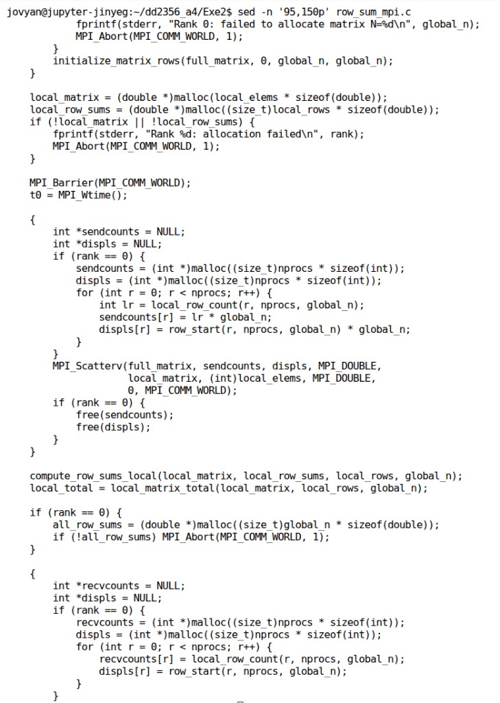

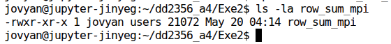

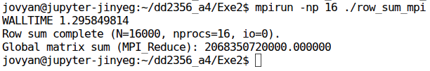

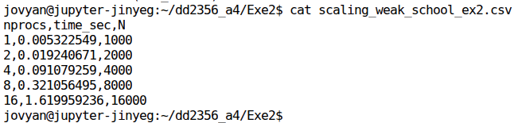

Dardel 截图（代码 / 编译 / 运行 / 扩展性）：

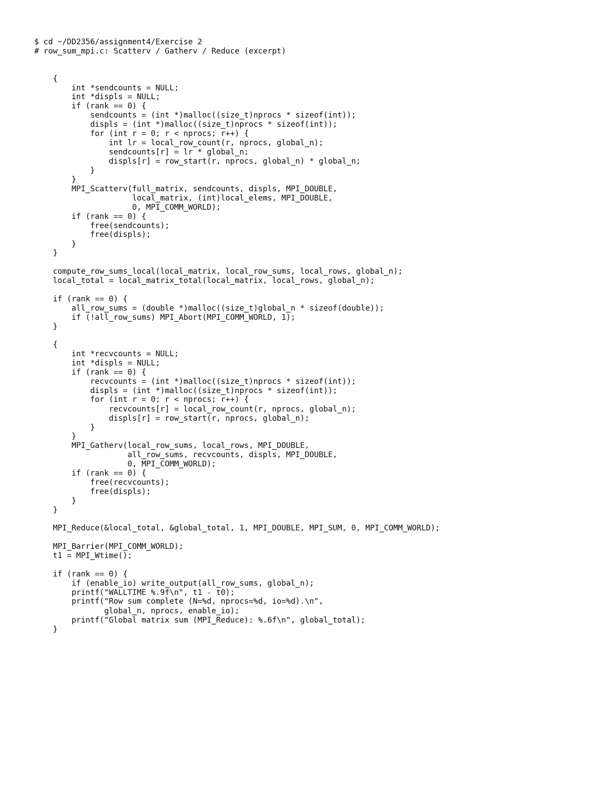

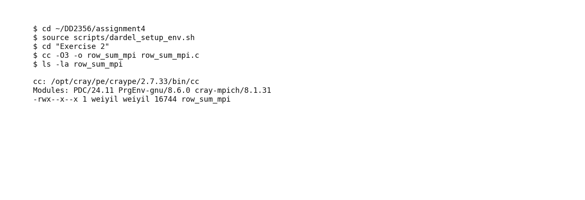

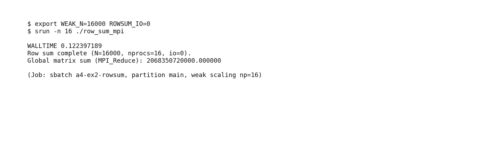

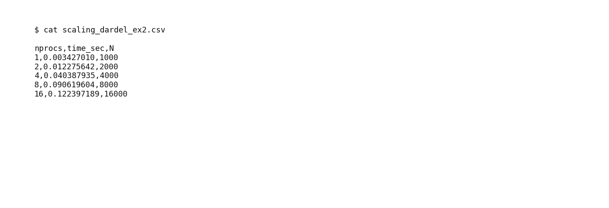

在 `np=16` 时，`MPI_Reduce` 全局和 = `2.06835072e12`（与初始化矩阵公式一致；学校与 Dardel 相同）。

串行与并行行和可视化对比（`WEAK_N=1000`；串行为 `np=1`，并行为 `np=4`）：

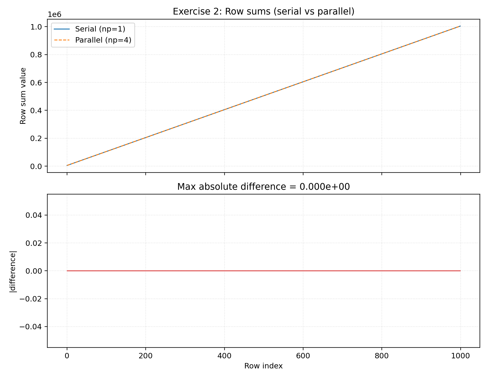

### 4. 弱扩展结果（时间，秒）

每 rank 基行数：**`N_base = 1000`**（全局 `N = 1000 × p`）；进程数：`1, 2, 4, 8, 16`。计时时关闭 I/O。

| 进程数 | 全局 N | 学校时间 (s) | Dardel 时间 (s) |
| ---: | ---: | ---: | ---: |
| 1 | 1000 | 0.00532 | 0.00343 |
| 2 | 2000 | 0.01924 | 0.01228 |
| 4 | 4000 | 0.09108 | 0.04039 |
| 8 | 8000 | 0.32106 | 0.09062 |
| 16 | 16000 | 1.61996 | 0.12240 |

原始 CSV：`Exercise 2/scaling_weak_school_ex2.csv`、`Exercise 2/scaling_dardel_ex2.csv`（副本见 `Artifacts/results/dardel/`）。

理想弱扩展：`T(p) ≈ T(1)`。

### 5. 图表：实测弱扩展 + 理想水平线

**学校集群：**

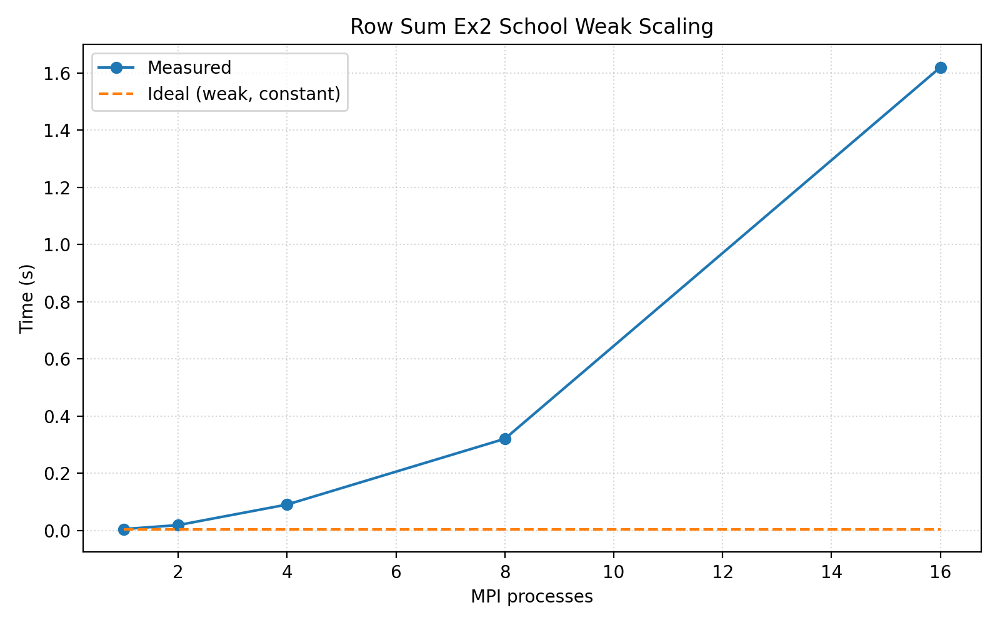

**Dardel：**

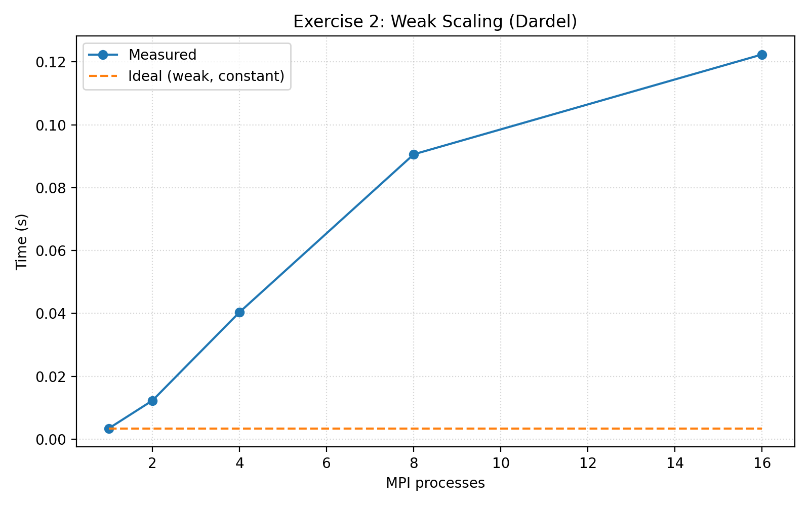

### 6. 性能分析

**学校集群：**

- 弱扩展 **非平坦**：每 rank 行数仍约 1000，时间从 1 进程的 `0.005s` 增至 16 进程的 `1.62s`。
- 主要原因：rank `0` 仍构建完整 `N×N` 矩阵（`O(N²)` 内存与初始化），且每次运行 `MPI_Scatterv` / `MPI_Gatherv` 传输 `O(N²)` 数据；弱扩展下 `N` 增大使集体通信开销占主导。
- `np=16`、`N=16000`（约 2 GB 矩阵）时，通信与 root 分配导致时间大幅上升。

**Dardel：**

- 时间从 `0.0034s` 增至 `0.122s`（×36），学校同序列约为 ×304。
- 大 `N` 时仍有集体通信与 root 端 `O(N²)` 设置开销，但专用节点与更快互连缩小了与理想弱扩展的差距。
- `np=16` 时 Dardel 比学校快约 **13 倍**（`0.122s` vs `1.62s`）。
- 最大规模 Score-P 指标见下文第 7 节。

### 7. Score-P 性能分析（Dardel，最大规模：np = 16）

我们在最大规模（`np=16`，`WEAK_N=16000`，`ROWSUM_IO=0`）下，使用 `PDC/24.11` 栈中的 `score-p/9.4-cpeCray-24.11` 完成了 `row_sum_mpi` profiling。

| 指标 | 数值 |
| --- | --- |
| MPI 调用总次数（`visits` 聚合） | **144** |
| MPI 调用耗时 | **16.95 s**（占总运行时间 17.65 s 的 **96.0%**） |
| 主要 MPI 例程 | `MPI_Init`（10.17 s）、`MPI_Barrier`（4.59 s）、`MPI_Scatterv`（1.57 s） |

---

## 练习 3 — 使用 MPI 与非阻塞通信的二维生命游戏

### 1. 实现

我们在 `Exercise 3/gol_mpi.c` 中基于 **二维域分解** 与 **非阻塞 ghost 交换** 并行化了 Conway 生命游戏。

#### 并行化策略

1. 将 `P` 个进程分解为二维网格 `Px × Py`（如 `P=16` 用 `4×4`）。
2. 每个 rank 拥有子域，四边各有一层 **单细胞宽 ghost**。
3. 每一代：
   - 对邻居 ghost 行/列发起 `MPI_Irecv`。
   - 对边界数据发起 `MPI_Isend`。
   - 可选：通信进行时在内部计算。
   - 更新边界前 `MPI_Waitall`。
   - 在本地应用 Conway 规则。
4. 周期边界：在 x、y 上用取模映射邻居 rank（环面）。
5. 计时：主循环外 `MPI_Wtime()` + `MPI_Barrier`；扩展性实验关闭 `write_output`。

非阻塞 halo 模式（示意）：

```c
MPI_Request reqs[8];
/* Irecv ghost rows/cols from up/down/left/right */
MPI_Irecv(..., &reqs[0]);
MPI_Isend(..., &reqs[1]);
/* ... */
update_interior();          /* overlap with communication */
MPI_Waitall(nreq, reqs, MPI_STATUSES_IGNORE);
update_boundaries();
```

#### Conway 规则（不变）

- 活细胞邻居 `<2` 或 `>3` 则死亡。
- 死细胞邻居恰为 `3` 则复活。
- 其余状态不变。

### 2. 编译与运行命令

#### 学校集群（并行效率）

```bash
cd ~/dd2356_a4/Exe3
chmod +x run_school_ex3.sh run_efficiency.sh
./run_school_ex3.sh
```

编译：**`mpicc -O3 -o gol_mpi gol_mpi.c`**

运行（效率）：**`mpirun -np <np> ./gol_mpi`**，并设置 `GOL_N=2000 GOL_STEPS=500 GOL_IO=0`

### 3. 正确性验证与可视化

MPI 使用 **方向性 tag**（`TAG_N2S`、`TAG_S2N` 等），使每条边上的发送方与接收方 tag 一致（修复 tag 不匹配导致的死锁）。

学校集群截图：

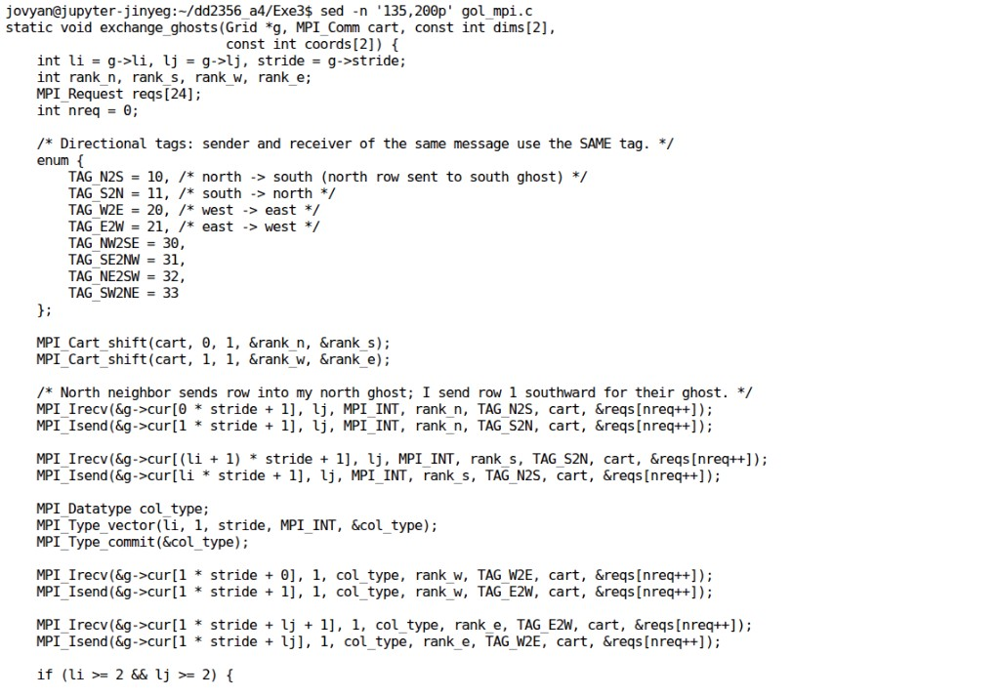

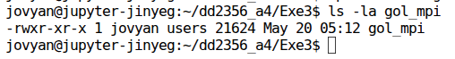

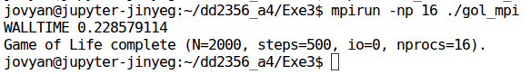

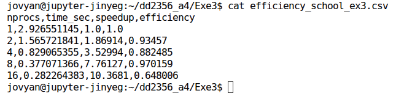

生命游戏正确性可视化（`GOL_N=200`、`GOL_STEPS=40`、`GOL_IO=1`、`np=4`；展示 step 0/10/20/30）：

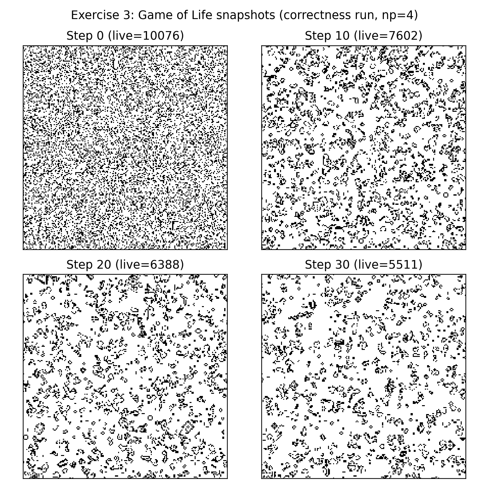

正确性运行（`GOL_IO=1`）可用 `python3 plot_gol.py` 可视化 `gol_output_*.txt`。

### 4. 并行效率（学校集群）

问题规模：**`N = 2000`**，**`STEPS = 500`**，**关闭 I/O**。

说明：图 17b 属于正确性可视化运行（`N=200`、`STEPS=40`、`I/O=1`）；下方效率表和效率图使用计时配置（`N=2000`、`STEPS=500`、`I/O=0`）。

| 进程数 | 时间 (s) | 加速比 S(p) | 效率 E(p)=S(p)/p |
| ---: | ---: | ---: | ---: |
| 1 | 2.9266 | 1.0000 | 1.0000 |
| 2 | 1.5657 | 1.8691 | 0.9346 |
| 4 | 0.8291 | 3.5299 | 0.8825 |
| 8 | 0.3771 | 7.7613 | 0.9702 |
| 16 | 0.2823 | 10.3681 | 0.6480 |

原始 CSV：`Exercise 3/efficiency_school_ex3.csv`。

### 5. 图表：并行效率 vs 进程数（学校集群）

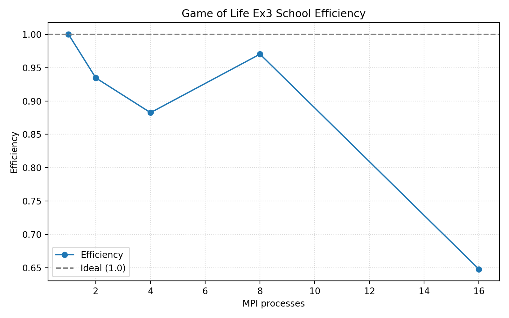

### 6. 性能分析（学校集群）

- 16 进程时加速比达 **10.37×**；8 进程前效率保持 **>88%**，16 进程降至 **65%**。
- 16 进程效率下降较常见：相对每 rank 内部计算，ghost 通信与 `MPI_Waitall` 开销增大，尽管边交换时内部计算可与通信重叠。
- 非阻塞 `MPI_Irecv`/`MPI_Isend` 允许边消息传输时执行 `update_interior()`；第一次 `Waitall` 与角点交换后再更新边界细胞。

---

## 附录：可复现文件

核心文档：

- `README.md`：项目概览与编译/运行摘要
- `Exercise 1/README.md`、`Exercise 2/README.md`、`Exercise 3/README.md`：各练习说明
- `scripts/README-dardel.md`：Dardel 模块、`edu26.dd2356`、Slurm 示例

源代码：

- `Exercise 1/wave_mpi.c` — 一维波动 + halo 交换
- `Exercise 2/row_sum_mpi.c` — 行求和 + 集体通信
- `Exercise 3/gol_mpi.c` — 生命游戏 + 非阻塞 ghost

脚本：

- `Exercise 1/run_scaling_strong.sh`、`Exercise 1/plot_wave.py`
- `Exercise 2/run_scaling_weak.sh`、`Exercise 2/plot_row_sums.py`
- `Exercise 3/run_efficiency.sh`、`Exercise 3/plot_gol.py`
- `plot_scaling_mpi.py` — 强/弱扩展绘图
- `scripts/dardel_setup_env.sh`、`scripts/dardel_run_mpi.slurm`

结果与图表：

- 练习 1（已完成）：
  - `Exercise 1/scaling_school_ex1.csv`、`Exercise 1/scaling_dardel_ex1.csv`
  - `Artifacts/plots/school/strong_scaling_ex1_school.png`
  - `Artifacts/plots/school/wave_serial_vs_parallel_ex1.png`
  - `Artifacts/plots/dardel/strong_scaling_ex1_dardel.png`
- 练习 2（已完成）：
  - `Exercise 2/scaling_weak_school_ex2.csv`、`Exercise 2/scaling_dardel_ex2.csv`
  - `Artifacts/plots/school/weak_scaling_ex2_school.png`
  - `Artifacts/plots/school/row_sums_serial_vs_parallel_ex2.png`
  - `Artifacts/plots/dardel/weak_scaling_ex2_dardel.png`
  - `Artifacts/screenshots/school/ex2_*.png`
  - `Artifacts/screenshots/dardel/ex2_*.png`
- 练习 3（按作业要求：学校集群效率）：
  - `Exercise 3/efficiency_school_ex3.csv`
  - `Artifacts/plots/school/efficiency_ex3_school.png`
  - `Artifacts/plots/school/gol_visualization_ex3.png`
  - `Artifacts/screenshots/school/ex3_*.png`
- Score-P（Ex1–2，Dardel）：已完成，使用 `score-p/9.4-cpeCray-24.11`；指标见练习 1/2 第 7 节
- 截图：`Artifacts/screenshots/school/`、`Artifacts/screenshots/dardel/`（Ex1–2）

Dardel 项目账号：**`edu26.dd2356`**

Dardel 工作目录：**`~/DD2356/assignment4`**
