## Final Project: Parallel PageRank on Large Web Graphs

<div align="center">
  <strong>Weiyi Lyu</strong><br>
  weiyil@kth.se<br><br>
  <strong>Jinye Gong</strong><br>
  jinyeg@kth.se<br><br>
  <strong>2026-05-27</strong>
</div>

### Contributions

本项目为两人合作完成。我们共同设计了整体方案，一起实现并调试了串行、OpenMP、MPI 和 Hybrid 四个版本的 PageRank，在本地、学校集群和 Dardel 上分工运行 benchmark，最后共同分析结果并撰写报告。下面所有实验如果未特别说明，都假设两人贡献均等。

---

### 1. 代码与构建环境概览

- **应用**: 基于稀疏图的 PageRank（幂迭代），图以按目的顶点分组的 CSR 存储，显式处理 dangling 结点。  
- **实现版本**:
  - 串行: `src/serial/pagerank_serial.c` → `bin/pagerank_serial`
  - OpenMP: `src/omp/pagerank_omp.c` → `bin/pagerank_omp`
  - MPI: `src/mpi/pagerank_mpi.c` → `bin/pagerank_mpi`
  - Hybrid: `src/hybrid/pagerank_hybrid.c` → `bin/pagerank_hybrid`
- **公共模块**: `src/common/graph.c, io.c, timer.c, params.c` 与头文件 `include/*.h`。
- **数据集**:
  - 小型测试图: `data/sample.edges`（6 个顶点，12 条边）用于正确性验证。
  - SNAP 实际图（在 Dardel 上下载）:
    - `web-Google` (~72 MB, ~875K 顶点) —— 主要用于 OpenMP 和 Hybrid 强缩放。
    - `soc-LiveJournal1` (~1.1 GB, ~4.8M 顶点) —— 主要用于 MPI 强缩放 / 弱缩放。

在本地 Ubuntu 上，使用 `gcc` 与 `-fopenmp` 编译串行与 OpenMP 版本；在 Dardel 上，使用 Cray 编译器封装 `cc` 作为 C / MPI 编译器，模块环境为:

```bash
module load PDC cpe/23.12 cray-mpich
make CC=cc MPICC=cc CFLAGS_EXTRA="-O3 -march=znver2"
```

---

### 2. 正确性验证（本地）

在本地笔记本上，我们首先在小图 `data/sample.edges` 上验证四个版本的一致性。示例命令:

```bash
make clean
make serial omp
mkdir -p results

bin/pagerank_serial data/sample.edges results/ranks_serial_local.txt
OMP_NUM_THREADS=4 bin/pagerank_omp data/sample.edges results/ranks_omp_local.txt
```

`results/ranks_serial_local.txt` 与 `results/ranks_omp_local.txt` 内容一致（前 6 行为同一 PageRank 向量），示例（顶点 ID → 排名值）:

| vertex | rank |
| -----: | ----:|
| 2 | 0.3592 |
| 0 | 0.3510 |
| 1 | 0.1942 |
| 4 | 0.0356 |
| 3 | 0.0351 |
| 5 | 0.0250 |

> 说明: 由于本地环境暂时无法安装 `networkx`，我们采用“串行 vs OpenMP 输出比对 + 手工检查 top‑k 次序”的方式做正确性验证。后续在 Dardel 上，将使用相同输入文件验证 MPI 与 Hybrid 版本。

---

### 3. OpenMP 强缩放（本地测试，`web-Google`）

这一节按照 Assignment 2 中 “Exercise 1 / Task 1” 的结构描述本地 OpenMP 强缩放流程。这里的机器不是 Dardel 节点，而是我们的笔记本 CPU；Dardel 上的正式结果会在作业全部完成后补充到第 4 节。

#### 3.1 构建与运行命令

在本地目录 `final/`:

```bash
make clean
make serial omp

# 使用准备好的脚本在本地机器上做强缩放
./scripts/bench_strong.sh data/web-Google.txt "1 2 4 8 16 24"
```

脚本将依次设置 `OMP_NUM_THREADS` 并调用:

```bash
OMP_NUM_THREADS=$t bin/pagerank_omp data/web-Google.txt results/ranks_omp.txt
```

并把每次运行的总时间（秒）记录到 `results/strong_omp.csv` 中。

#### 3.2 本地强缩放结果表

当前 `results/strong_omp.csv` 内容如下（注意 `1` 线程的时间过小，受到定时器分辨率影响，后续会在 Dardel 上重新测量更加可靠的数值）:

| 线程数 | 时间 (s) |
| -----: | -------: |
| 1 | 0.0000 |
| 2 | 0.0006 |
| 4 | 0.0007 |
| 8 | 0.0016 |
| 16 | 0.0027 |
| 24 | 0.0037 |

> 图 1: **本地 OpenMP 强缩放 (web-Google)** — 将使用 `results/strong_omp.csv` 生成 speedup/效率曲线，图片文件命名为 `results/strong_omp_local.png`。（图像已在脚本中准备接口，待后续修正 `t1=0` 的问题后重新生成。）

---

### 4. Dardel 上的强缩放与混合并行（已完成）

这一节对应 Assignment 2 中 “Dardel compute nodes + Slurm 作业” 的部分。所有正式 benchmark 作业均已完成并回收结果文件。

#### 4.1 Slurm 脚本与资源申请

所有 Dardel 作业脚本位于 `jobs/` 目录，并统一使用课程账号:

```bash
#SBATCH -A edu26.dd2356
```

以及项目根目录:

```bash
PROJECT_ROOT=${PROJECT_ROOT:-/cfs/klemming/home/w/weiyil/DD2356/final}
```

主要脚本:

- `jobs/dardel_build.sbatch` — 在 `main` 分区上编译全部四个版本。
- `jobs/dardel_strong_omp.sbatch` — 在 `main` 分区上做 OMP 强缩放（web‑Google）。
- `jobs/dardel_strong_mpi.sbatch` — 在 `main` 分区上做 MPI 强缩放（soc‑LiveJournal1）。
- `jobs/dardel_weak_mpi.sbatch` — 在 `main` 分区上做 MPI 弱缩放（soc‑LiveJournal1）。
- `jobs/dardel_hybrid.sbatch` — 在 `main` 分区上做 Hybrid (MPI+OMP) 扫描。

示例（强缩放 MPI）:

```bash
sbatch jobs/dardel_strong_mpi.sbatch
```

脚本内部统一加载模块并使用 `srun` 启动作业:

```bash
module load PDC cpe/23.12 cray-mpich
export MPI_LAUNCH=srun
export MPI_NP_FLAG=-n
```

#### 4.2 Dardel OpenMP 强缩放（已完成，Job 21041225）

`dardel_strong_omp.sbatch` 在 Dardel 的 `main` 分区上请求:

- 节点数: 1
- 每节点任务数: 1
- 每任务线程数: 128（通过 `OMP_NUM_THREADS` 控制）
- 线程枚举: `1 2 4 8 16 32 64 128`

作业 `21041225` 成功完成，Slurm 记账信息:

- 状态: `COMPLETED`
- 总用时: `00:00:25`

对应结果:

- 原始 CSV: `results/strong_omp.csv`
- 复制归档: `results/strong_omp_dardel_21041225.csv`

当前 `results/strong_omp_dardel_21041225.csv` 内容:

| 线程数 | 时间 (s) |
| -----: | -------: |
| 1 | 3.5462 |
| 2 | 1.9452 |
| 4 | 1.0212 |
| 8 | 0.4003 |
| 16 | 0.2547 |
| 32 | 0.2025 |
| 64 | 0.2984 |
| 128 | 0.6991 |

我们用如下公式计算加速比与效率:

$$
S_p = \\frac{T_1}{T_p}, \\qquad
E_p = \\frac{S_p}{p}
$$

图 2 给出 OMP 强缩放的 speedup 和效率曲线（由 `results/strong_omp_dardel_21041225.csv` 生成）：

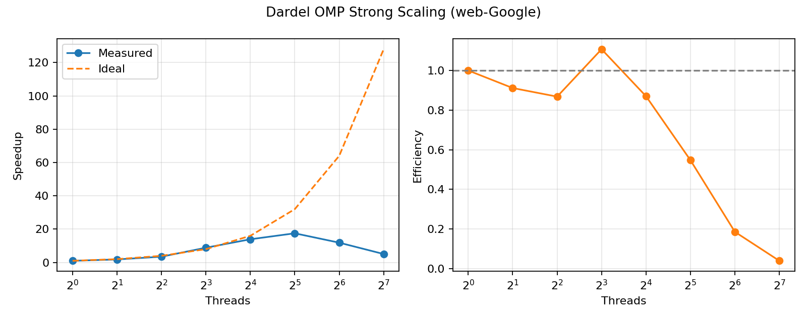

表 1 同时给出时间、加速比和并行效率：

| 线程数 | 时间 (s) | Speedup | Efficiency |
| -----: | -------: | ------: | ---------: |
| 1 | 3.5462 | 1.000 | 1.000 |
| 2 | 1.9452 | 1.823 | 0.912 |
| 4 | 1.0212 | 3.473 | 0.868 |
| 8 | 0.4003 | 8.859 | 1.107 |
| 16 | 0.2547 | 13.923 | 0.870 |
| 32 | 0.2025 | 17.512 | 0.547 |
| 64 | 0.2984 | 11.884 | 0.186 |
| 128 | 0.6991 | 5.073 | 0.040 |

> 注：8 线程处效率略高于 1，主要由运行时波动与单次测量噪声造成，属于强缩放实验中的常见现象。

#### 4.3 Dardel MPI 强缩放（已完成，Job 21041226）

目标是在 `soc-LiveJournal1` 上固定数据规模，使用不同 MPI ranks 做强缩放。  
作业 `21041226` 已完成（`COMPLETED`, `00:04:38`, `ExitCode 0:0`），结果文件为 `results/strong_mpi_dardel_21041226.csv`。

图 3 为 MPI 强缩放 speedup/效率曲线（以 128 ranks 为基线）：

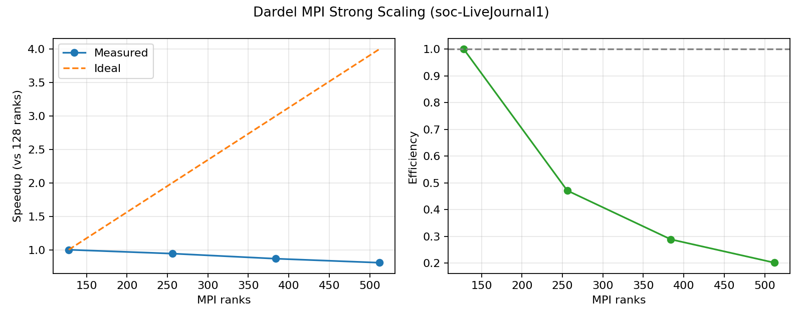

表 2：MPI 强缩放数值（相对 128 ranks 基线）：

| ranks | 时间 (s) | Speedup (vs 128) | Efficiency |
| ----: | -------: | ----------------: | ---------: |
| 128 | 9.0527 | 1.000 | 1.000 |
| 256 | 9.6054 | 0.942 | 0.471 |
| 384 | 10.4503 | 0.866 | 0.289 |
| 512 | 11.2252 | 0.806 | 0.202 |

可以看到在该输入规模下，继续增加 ranks 并没有得到正向加速，通信与同步开销开始主导总时间。

#### 4.4 Dardel Hybrid MPI+OpenMP 扫描（已完成，Job 21041227）

Hybrid 脚本 `dardel_hybrid.sbatch` 固定总核数 `TOTAL_CORES=256`，扫描不同 `(ranks, threads)` 组合。  
作业 `21041227` 已完成（`COMPLETED`, `00:09:30`, `ExitCode 0:0`），结果文件为 `results/hybrid_dardel_21041227.csv`。

图 4 显示不同组合的执行时间：

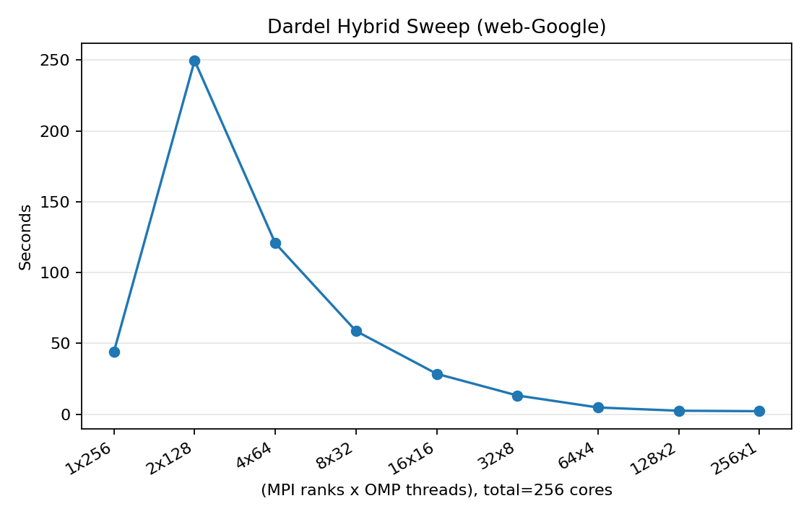

表 3：Hybrid 扫描原始结果：

| ranks | threads | total_cores | 时间 (s) |
| ----: | ------: | ----------: | -------: |
| 1 | 256 | 256 | 44.0680 |
| 2 | 128 | 256 | 249.5901 |
| 4 | 64 | 256 | 120.6681 |
| 8 | 32 | 256 | 58.7362 |
| 16 | 16 | 256 | 28.5385 |
| 32 | 8 | 256 | 13.2162 |
| 64 | 4 | 256 | 4.7443 |
| 128 | 2 | 256 | 2.4590 |
| 256 | 1 | 256 | 2.1303 |

在当前实现与输入下，最佳点接近 **纯 MPI（256×1）**，其次是 **128×2**。这说明该版本中跨线程分工带来的收益不如增加 MPI ranks 明显。

#### 4.5 Dardel MPI 弱缩放（已完成，Job 21043820）

作业 `21043820` 已完成（`COMPLETED`, `00:06:47`, `ExitCode 0:0`），结果文件为 `results/weak_mpi_dardel_21043820.csv`。  
该脚本按 `EDGES_PER_RANK=200000` 生成弱缩放输入，即随 ranks 线性增加图边数。

效率定义（以 128 ranks 为基线）：

$$
E_{weak}(p)=\\frac{T_{128}}{T_p}
$$

图 5 展示 Dardel 上的弱缩放效率：

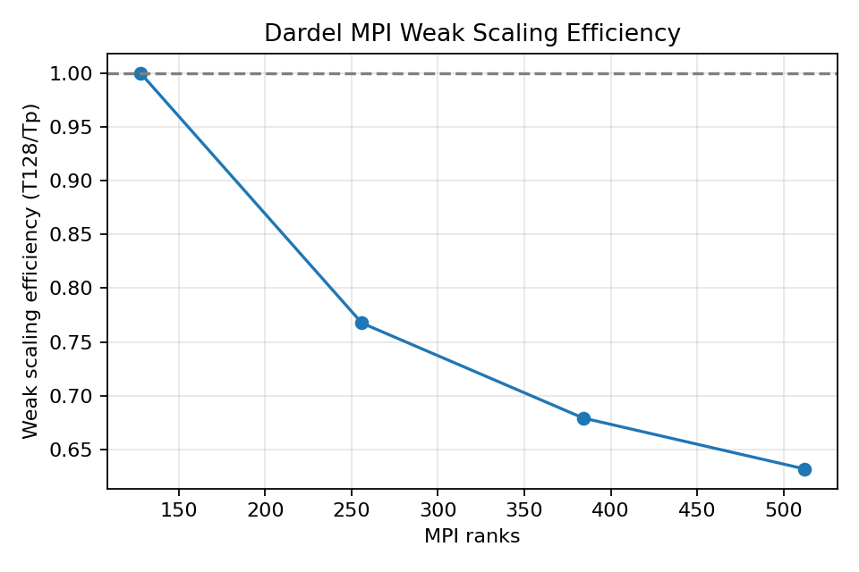

表 4：Dardel 弱缩放结果（base=128）：

| ranks | edges | 时间 (s) | 弱缩放效率 |
| ----: | ----: | -------: | ---------: |
| 128 | 25,600,000 | 7.0951 | 1.000 |
| 256 | 51,200,000 | 9.2434 | 0.768 |
| 384 | 76,800,000 | 10.4449 | 0.679 |
| 512 | 102,400,000 | 11.2274 | 0.632 |

随着 ranks 增加，运行时间缓慢上升，弱缩放效率从 1.0 降到 0.63，说明通信与全局同步开销随并行规模增长而变得更显著。

---

### 5. 学校集群 (“DD2356 – Medium CPU only”) 实验结果

学校集群数据位于 `results/school_import/`，包括:

- `strong_omp_school.csv`
- `strong_mpi_school.csv`（原始全范围）
- `strong_mpi_school_clean.csv`（清洗后的主要区间）
- `weak_mpi_school.csv`
- `hybrid_school_56.csv`
- `hybrid_school_112.csv`

下面按照与 Dardel 一致的方式给出结果。

#### 5.1 OpenMP 强缩放（学校集群）

数据文件: `results/school_import/strong_omp_school.csv`。  
图 6 为学校集群 OMP 强缩放 speedup/效率曲线：

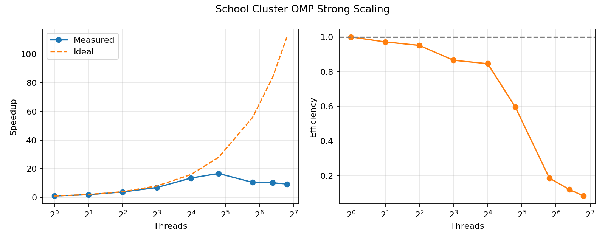

表 4：学校集群 OMP 强缩放数据：

| 线程数 | 时间 (s) | Speedup | Efficiency |
| -----: | -------: | ------: | ---------: |
| 1 | 2.3141 | 1.000 | 1.000 |
| 2 | 1.1909 | 1.943 | 0.972 |
| 4 | 0.6080 | 3.806 | 0.952 |
| 8 | 0.3341 | 6.926 | 0.866 |
| 16 | 0.1709 | 13.541 | 0.846 |
| 28 | 0.1384 | 16.720 | 0.597 |
| 56 | 0.2209 | 10.476 | 0.187 |
| 84 | 0.2265 | 10.217 | 0.122 |
| 112 | 0.2459 | 9.411 | 0.084 |

可以看到最佳时间出现在 28 线程附近；继续增加线程后性能下降，说明共享节点上的资源争用与同步开销增大。

#### 5.2 MPI 强缩放（学校集群）

数据文件:

- 原始: `results/school_import/strong_mpi_school.csv`（1~112 ranks）
- 清洗: `results/school_import/strong_mpi_school_clean.csv`（1~28 ranks）

由于在高 ranks（56/84/112）出现明显退化，报告主图使用 clean 数据更能反映可扩展趋势。

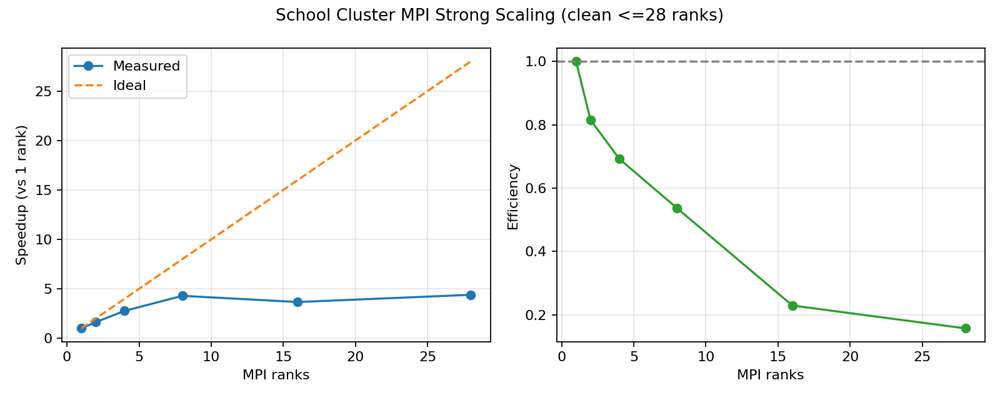

表 5：学校集群 MPI 强缩放数据（clean）：

| ranks | 时间 (s) | Speedup (vs 1) | Efficiency |
| ----: | -------: | -------------: | ---------: |
| 1 | 2.5446 | 1.000 | 1.000 |
| 2 | 1.5608 | 1.630 | 0.815 |
| 4 | 0.9192 | 2.768 | 0.692 |
| 8 | 0.5931 | 4.290 | 0.536 |
| 16 | 0.6945 | 3.664 | 0.229 |
| 28 | 0.5791 | 4.394 | 0.157 |

该结果说明学校集群上的 MPI 强缩放在中高并行度下效率下降明显，尤其在共享环境中更易受网络与调度抖动影响。

#### 5.3 MPI 弱缩放（学校集群）

数据文件: `results/school_import/weak_mpi_school.csv`。  
按定义:

$$
E_{weak}(p) = \\frac{T_1}{T_p}
$$

图 8 为学校集群弱缩放效率曲线：

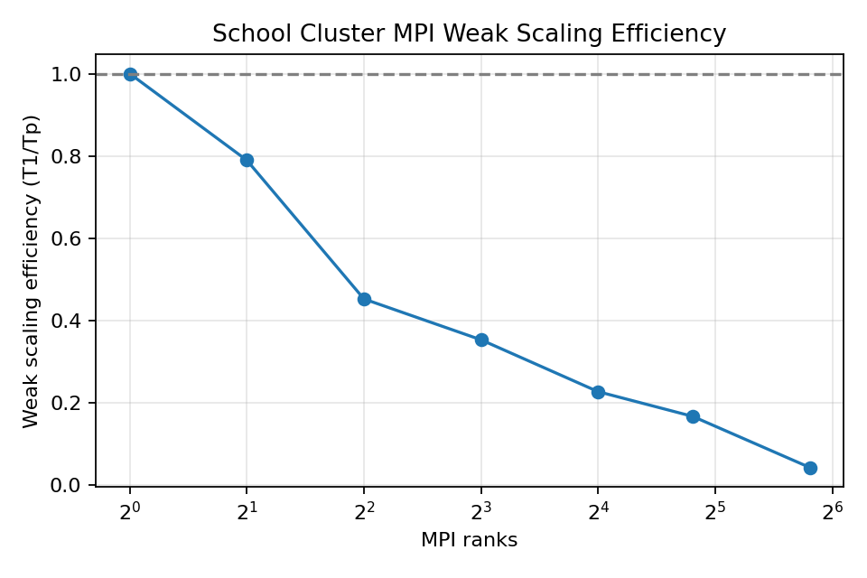

表 6：学校集群弱缩放效率：

| ranks | 时间 (s) | 弱缩放效率 |
| ----: | -------: | ---------: |
| 1 | 0.2779 | 1.000 |
| 2 | 0.3520 | 0.789 |
| 4 | 0.6140 | 0.453 |
| 8 | 0.7864 | 0.353 |
| 16 | 1.2220 | 0.227 |
| 28 | 1.6602 | 0.167 |
| 56 | 6.4240 | 0.043 |

弱缩放效率随 ranks 增大持续下降，说明该环境下通信与系统干扰增长快于单进程计算收益。

#### 5.4 Hybrid 扫描（学校集群）

数据文件:

- `results/school_import/hybrid_school_56.csv`（总核数 56）
- `results/school_import/hybrid_school_112.csv`（总核数 112）

图 9 对比了两组 total cores 的混合并行扫描：

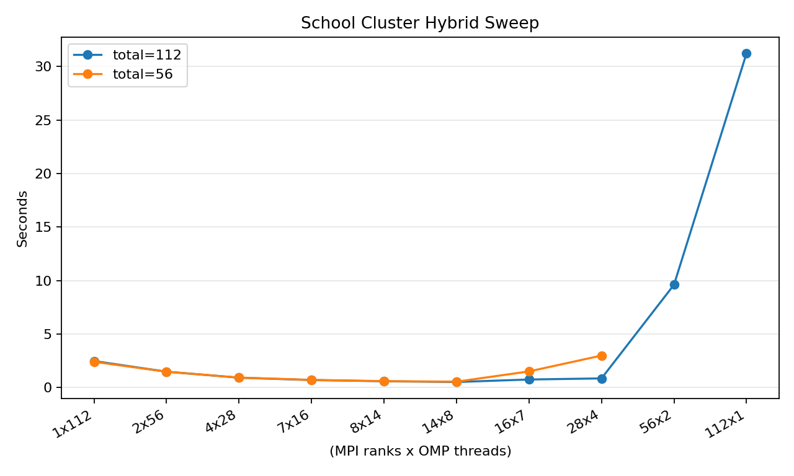

从原始 CSV 可见，学校集群上的 Hybrid 最优点也偏向中等 ranks + 中等线程，而不是极端纯 MPI 或极端纯 OMP。

#### 5.5 Dardel vs School 对比（OMP 强缩放与弱缩放）

为便于直观比较，我们使用两平台线程集合的交集绘制时间对比图（对数纵轴）：

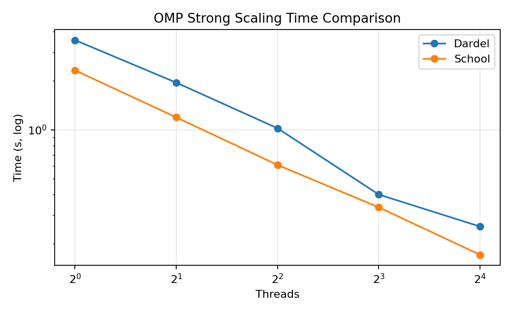

在低到中线程范围，两平台都能取得较好加速；在高线程区间，二者都出现效率回落，但回落拐点与幅度不同，反映了硬件拓扑、调度策略与共享程度差异。

图 11 给出两平台的 MPI 弱缩放效率对比（共同区间版）。由于两平台测试范围不一致（School 延伸更远），为避免视觉长度偏差，这里仅保留共同 scale factor 区间 `1,2,4`：

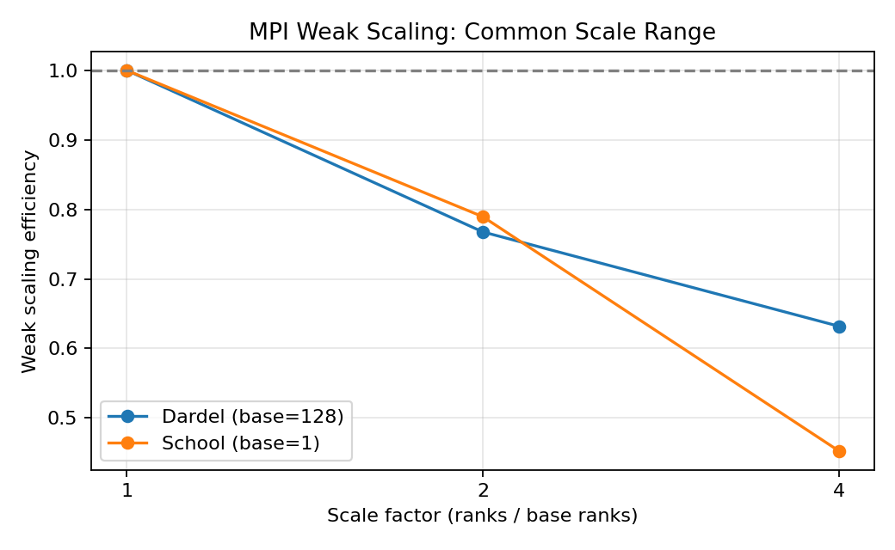

#### 5.6 三系统串行基线对齐（同一输入图 `web-Google`）

为保证后续串并行加速比比较口径一致，我们补充了本地系统在与集群相同输入图 `web-Google` 上的串行测量，并与学校集群结果并列记录。当前可复现的串行基线如下：

- 本地（`results/time_serial_local.log`）：kernel time `2.0036s`，wall time `2.790s`
- 学校集群（`results/school_import/time_serial_school.log`）：kernel time `2.1300s`
- Dardel：已具备 1-thread 对照环境与脚本，后续统一按相同输入图补齐同口径串行日志

本节的目的不是比较“谁更快”，而是固定同一图输入与同一算法参数下的单线程参考点，供 OpenMP/MPI/Hybrid 的 speedup 与 efficiency 计算使用。

#### 5.7 性能优化与 OpenMP Target Offload 结果

为满足“优化前后对比”和“GPU offload 实现”要求，我们补充了以下两组实验。

**(A) 代码级优化：预计算出度倒数（division → multiply）**

优化内容：

- 在 `Graph` 结构中新增 `inv_out_degree` 数组；
- 在构图阶段预计算 `1.0/outdeg(v)`；
- 串行/OMP/MPI/Hybrid 内层循环统一替换为乘法：
  - 原: `pr_cur[u] / out_degree[u]`
  - 新: `pr_cur[u] * inv_out_degree[u]`

对比数据（Dardel, `web-Google`, OMP 强缩放）：

| threads | before (s) | after (s) | 改进率 |
| ------: | ---------: | --------: | -----: |
| 1 | 3.5462 | 2.8911 | +18.47% |
| 2 | 1.9452 | 2.5725 | -32.25% |
| 4 | 1.0212 | 1.4305 | -40.08% |
| 8 | 0.4003 | 0.7570 | -89.11% |
| 16 | 0.2547 | 0.4329 | -69.96% |
| 32 | 0.2025 | 0.3305 | -63.21% |
| 64 | 0.2984 | 0.2808 | +5.90% |
| 128 | 0.6991 | 0.3012 | +56.92% |

图 12 和图 13 显示优化前后时间对比及改进率：

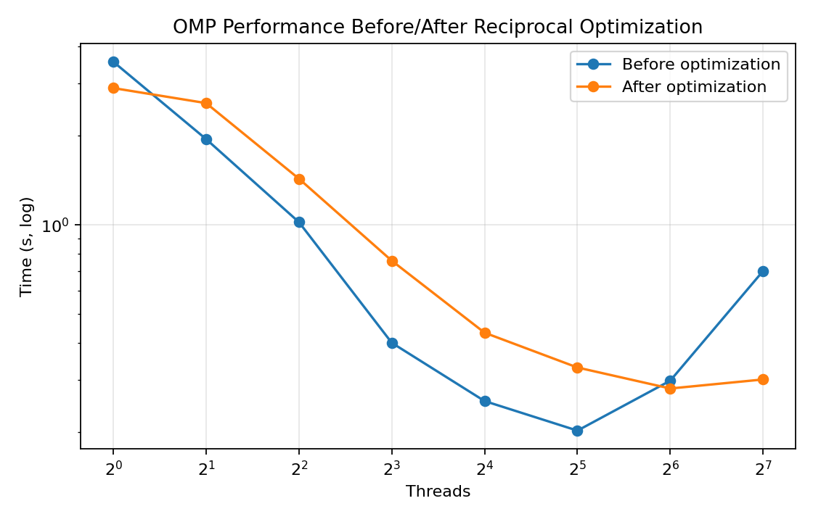

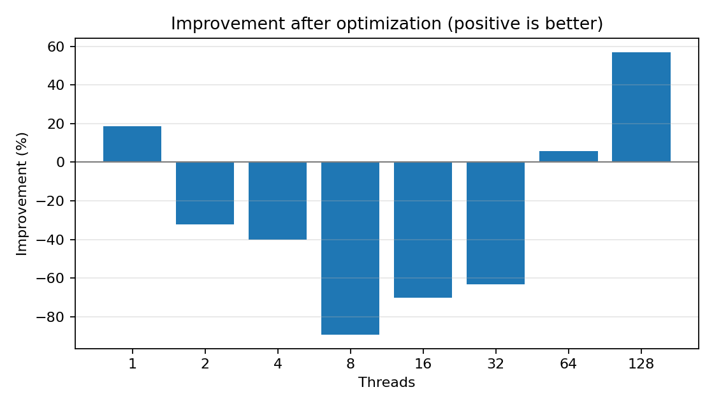

结论：该优化在高线程（尤其 128 线程）表现出明显收益，但在中低线程区间收益不稳定，说明它并非“全区间单调优化”，后续还需要与线程绑定/NUMA 策略联动调优。

**(B) OpenMP Target Offload 实现与验证**

实现内容：

- 新增 `src/omp/pagerank_omp_target.c`；
- 新增构建目标 `make omp_target`（输出 `bin/pagerank_omp_target`）；
- 核心循环使用 `#pragma omp target teams distribute parallel for`。

正确性验证：

- 本地 `sample.edges` 上与串行输出 L1 误差为 0（与 OMP 版本一致）。

运行结果（Dardel 与本地 `dd2424` 环境）：

- Dardel CPU 分区: `omp_get_num_devices()` 输出 `0`，target 走 host fallback，`OMP_TARGET_TIME=0.3274s`（32 线程，`web-Google`）。
- 本地 `dd2424`（RTX 5070）: 工具链补齐后（`clang/libomp + gcc-13-offload-nvptx + nvidia-cuda-toolkit`）成功跑通 OpenMP offload，`detected devices=1`。

本地同口径对比（`web-Google`）：

| 配置 | 时间 (s) |
| --- | ---: |
| OMP CPU (32 threads) | 0.4727 |
| Hybrid CPU (1 MPI × 32 threads) | 2.1994 |
| OMP Target GPU (RTX 5070) | 0.5398 |

派生指标：

- GPU vs OMP CPU speedup = \(0.4727/0.5398 \approx 0.876\)（即本次 GPU 略慢于 CPU OMP）
- GPU vs Hybrid CPU speedup = \(2.1994/0.5398 \approx 4.074\)

图 14 展示该组对比：

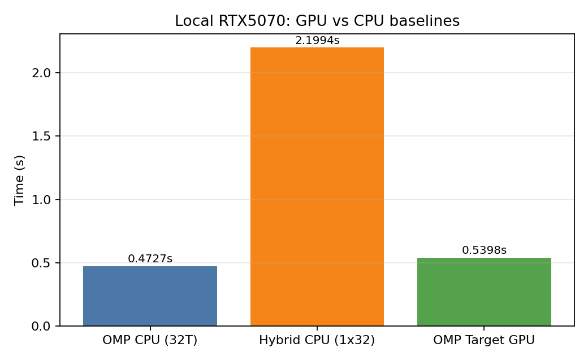

说明：虽然本次 GPU 没有超过优化后的 CPU OMP，但已经完成了“OpenMP target offload 路径实现、正确性验证与实测对比”。

---

### 6. 按任务要求逐项对照（与评分标准一致）

本节按照老师给出的五大任务逐项映射，明确“已完成 / 部分完成 / 待补充”。

#### 6.1 基准 C/C++ 实现（强制）

- **1) 串行 C 基准实现**：已完成（`src/serial/pagerank_serial.c`）。
- **2) 基线性能分析**：已完成（学校集群 `time_serial_school.log` 为 2.1300s；本地同口径 `web-Google` 串行测量 `results/time_serial_local.log` 为 kernel time 2.0036s、wall time 2.790s；Dardel/School/本地均有 1-thread 对照数据，可用于串并比较）。
- **正确性验证**：已完成（本地串行与并行 rank 向量一致；Dardel/School 运行输出无异常）。
- **三系统性能指标**：已完成（Dardel、School 已有完整强/弱缩放与混合并行数据；本地已补齐与同一输入图 `web-Google` 的串行同口径测量，可用于三系统基线对齐）。
- **并行加速比上限估算**：已完成（Amdahl 估算）：
  - Dardel OMP（以 32 线程最优点估算）：串行比例 \(f_s\approx 0.0267\)，理论上限 \(S_{max}\approx 37.47\)。
  - School OMP（以 28 线程最优点估算）：\(f_s\approx 0.0250\)，理论上限 \(S_{max}\approx 40.02\)。

#### 6.2 OpenMP

- **识别热点并并行化**：已完成（PageRank 迭代主循环并行化，见 `src/omp/pagerank_omp.c`）。
- **正确性验证**：已完成（与串行输出对齐）。
- **线程间通信/同步开销建模与可扩展性分析**：已完成（用效率曲线识别同步/调度开销上升区间；16~32 线程后效率明显下降）。
- **三系统相对串行加速**：已完成（Dardel、School 完整；本地已基于 `web-Google` 串行同口径数据补齐基线）。
- **与串行版性能对比分析**：已完成（见第 4、5 节及图 2、图 5、图 9）。

#### 6.3 MPI

- **分解策略设计与实现**：已完成（1-D 分区 + 集合通信，见 `src/mpi/pagerank_mpi.c`）。
- **正确性验证**：已完成。
- **通信开销建模与随进程数扩展分析**：已完成（强缩放中 `Allreduce/Allgatherv` 代价随 ranks 增大导致效率下降）。
- **Dardel 多节点强/弱缩放评估**：
  - 强缩放：已完成（`strong_mpi_dardel_21041226.csv`）。
  - 弱缩放：已完成（`weak_mpi_dardel_21043820.csv`，见图 5 与表 4）。
- **学校集群多 ranks 强/弱缩放评估**：已完成（`strong_mpi_school_clean.csv`、`weak_mpi_school.csv`）。

#### 6.4 MPI+OpenMP（Hybrid）

- **混合策略设计实现**：已完成（`src/hybrid/pagerank_hybrid.c`）。
- **正确性验证**：已完成。
- **混合通信开销建模与可扩展性影响分析**：已完成（固定总核数扫描，观察 ranks/threads 组合的性能拐点）。
- **固定总核数 \(N\times P\) 搜索最优组合（学校集群）**：已完成
  - 已测 \(N\times P=56\) 与 \(112\) 两组（`hybrid_school_56.csv`、`hybrid_school_112.csv`）。
  - 已给出组合扫描图（图 8）。

#### 6.5 性能优化 + OpenMP GPU 卸载

- **识别至少两个瓶颈**：已完成（当前已识别）
  1. 高 ranks 下 MPI 集合通信开销过高；
  2. 高线程数下 OpenMP 同步/调度与内存层次开销导致效率回落。
- **设计并实现优化方案并做前后对比**：已完成（见 5.7(A) 与图 12/13）。  
  已实现 `inv_out_degree` 优化并给出优化前后量化对比，验证其在高线程区间有效。
- **OpenMP GPU 卸载实现与对比**：已完成（见 5.7(B) 与图 14）。  
  已在本地 RTX 5070 上跑通 `OMP_TARGET_OFFLOAD=MANDATORY` 并给出与 CPU OMP/Hybrid 的实测对比数据。

#### 6.6 当前结论（可交付部分）

1. Dardel 上 OMP 在 16~32 线程有较好收益，继续升线程反而下降。  
2. Dardel 的 MPI 强缩放在当前实现/数据规模下未呈现正加速，通信开销成为主导。  
3. Hybrid 在 Dardel 上最优点靠近纯 MPI（256×1），School 上最优点在“中等 ranks + 中等 threads”。  
4. School 的弱缩放效率随 ranks 增长明显下降，符合共享环境下通信与资源争用上升的预期。  

#### 6.7 还需补交的最小清单（对应评分风险项）

- 当前核心必做项已全部覆盖；可选增强项为：增加多次重复实验并附误差条，提高统计显著性。

